# Tarea 1: Introducción a Ansible

En esta práctica he configurado un entorno básico con Ansible para gestionar una máquina virtual Debian de forma remota. He preparado el nodo de control con Ansible instalado y he creado un usuario con acceso SSH y permisos `sudo` sin contraseña en el nodo gestionado.

A lo largo del ejercicio he creado los ficheros `hosts` y `ansible.cfg`, y he probado los módulos esenciales (`ping`, `command`, `copy`, `file`, `apt`, `service` y `user`) para comprobar la conectividad, copiar ficheros, gestionar directorios, instalar paquetes, controlar servicios y administrar usuarios. El objetivo ha sido familiarizarme con el funcionamiento de Ansible y observar su comportamiento idempotente al ejecutar comandos ad hoc.


#### 1. Preparar la máquina virtual

Primero vamos a preparar la máquina virtual que vamos a gestionar con Ansible. Nos conectamos a la VM y actualizamos los repositorios:

###### 1.1 Instalamos los paquetes

```
sudo apt update
sudo apt install -y openssh-server sudo python3
sudo systemctl enable ssh
```

- `apt update` actualiza la lista de paquetes disponibles.

- `apt install -y` instala los paquetes sin pedir confirmación (`-y` responde "sí" automáticamente).

- `openssh-server` permite acceder por SSH a la máquina.

- `sudo` da permisos de administración.

- `python3` es necesario porque Ansible ejecuta scripts de Python en el nodo remoto.

- `systemctl enable --now ssh` activa el servicio SSH y lo inicia inmediatamente

###### 1.2 Miramos la IP de nuestra maquina virtual

Con:

```
hostname -I
```

En mi caso es la 192.168.122.56

###### 1.3 Creacion del usuario sin privilegios

En este caso no vamos a crear ningun usuario y vamos a usar el usuario que hemos creado en la propia instalacion "usuario".

Creamos el fichero /etc/sudoers.d/usuario y escribimos la siguiente linea

```
usuario ALL=(ALL) NOPASSWD:ALL
```

Establecemos permisos de solo lectura para el propietario y grupo

```
sudo chmod 440 /etc/sudoers.d/usuario
```

###### 1.4 Comprobamos que la configuración es valida

```
sudo visudo -c
```

`visudo -c` verifica la sintaxis de los ficheros de configuración de `sudo` sin editarlos.


#### 2. Crear la clave SSH

En nuestro portatil, es decir en el host, vamos a crear el par de claves:

```
ssh-keygen -t rsa -f ~/.ssh/id_rsa
```

- `ssh-keygen` genera una nueva clave SSH.

- `-t rsa` elige el tipo de algoritmo.

- `-f ~/.ssh/id_rsa` indica el nombre y ruta del fichero donde guardar la clave.

Pulsamos `Enter` para aceptar la ubicación y dejamos la passphrase vacía para simplificar.

###### 2.1 Copiamos clave en MV

A continuacion vamos a usar ssh-copy-id para copiar la clave publica del host en la MV:

```
ssh-copy-id -i ~/.ssh/id_rsa.pub usuario@192.168.122.56
```

`-i ~/.ssh/id_rsa.pub` especifica qué clave pública copiar.


###### 2.1 Comprobamos que podemos acceder sin contraseña

Para comprobarlo simplemente vamos a realizar una conexión ssh con el usuario:

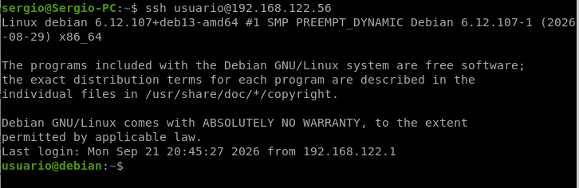

Como podemos ver, he podido acceder sin problemas, esto vendrá muy bien en el futuro para la automatizacion de procesos.

###### 2.2 Comprobamos que el usuario es sudo

Si todo esta correcto cuando ejecutamos "sudo whoami" deberia aparecer "root"

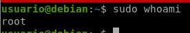


#### 3. Instalar Ansible

En nuestro equipo local instalamos Ansible:

```
sudo apt update 
sudo apt install -y ansible
```

#### 4. Crear el proyecto

Primero creamos la carpeta donde estara el contenido de nuestro proyecto

```
mkdir -p ~/proyecto-ansible
cd ~/proyecto-ansible
```

#### 5. Configurar Ansible

Una vez que tengamos todo instalado correctamente vamos a pasar a configurar Ansible y empezaremos creando los ficheros hosts.yml y ansible.cfg dentro de la carpeta del proyecto

###### 5.1 Configurar el inventario (hosts)

Creamos el fichero hosts.yml y añadimos lo siguiente:

```
all:
  children:
    servidores:
      hosts:
        nodo1:
          ansible_ssh_host: 192.168.122.56
          ansible_ssh_user: usuario
          ansible_ssh_private_key_file: ~/.ssh/id_rsa
```

- `all` es el grupo raíz que contiene todos los hosts.

- `children` define subgrupos dentro de `all`.

- `servidores` es el nombre de nuestro grupo personalizado.

- `hosts` lista los equipos dentro del grupo.

- `nodo1` es el nombre que le damos a nuestra máquina virtual.

- `ansible_ssh_host` indica la IP a la que conectarse.

- `ansible_ssh_user` es el usuario que Ansible usará para SSH.

- `ansible_ssh_private_key_file` apunta al fichero con la clave privada para autenticarse.

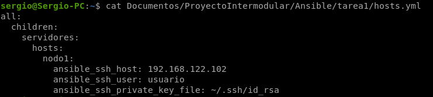

###### 5.2. Configuración del fichero ansible.cfg

El contenido que tendremos en este fichero durante esta practica será:

```
[defaults]
inventory = hosts.yml
host_key_checking = False
```

- `[defaults]` es la sección de configuración por defecto.

- `inventory = hosts` le dice a Ansible que use el fichero `hosts` como inventario.

- `host_key_checking = False` desactiva la verificación de la huella SSH del host remoto (útil en entornos de prueba, pero no recomendado en producción).

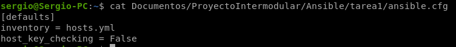

#### 6. Comprobar la conectividad

Una vez que tengamos todo perfectamente configurado este comando deberia darnos la siguiente salida:

```
ansible all -m ping
```

Salida:

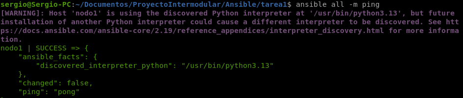

- `ansible` es el comando para ejecutar módulos ad hoc.

- `all` selecciona todos los hosts del inventario.

- `-m ping` usa el módulo `ping`, que verifica la conexión SSH y que Python esté disponible en el nodo remoto.

Tambien podriamos usar este comando que limita la ejecucion al grupo que definimos en el inventario:

```
ansible servidores -m ping
```

O incluso podemos ejecutarlo en nodos o maquinas concretas:

```
ansible nodo1 -m ping
```

#### 7. Ejecutar comandos en Ansible con command y shell

###### 7.1 Ejecutamos "hostname"

Probamos con command:

```
ansible nodo1 -m command -a "hostname"
```

- `-m command` usa el módulo ansible"command" para ejecutar un comando simple en el nodo remoto.

- `-a "hostname"` pasa los argumentos al módulo, en este caso el comando `hostname` que devuelve el nombre de la máquina.

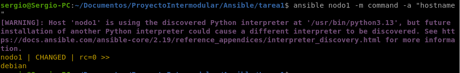

O con shell:

```
ansible nodo1 -m shell -a "hostname"
```

- `-m shell` ejecuta el comando a través del shell del sistema, permitiendo pipes, redirecciones y variables de entorno.

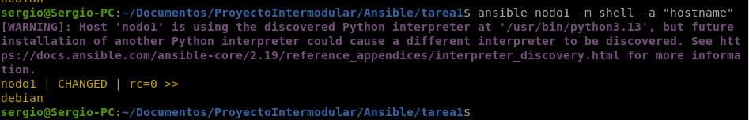

###### 7.2 Ejecutamos el modulo copy

Copiaremos un fichero de la maquina host a la MV de la siguiente manera:

```
ansible all -m copy -a "src=~/Documentos/prueba.txt dest=/tmp/prueba.txt mode=0644"
```

- `-m copy` usa el módulo que copia ficheros desde el nodo de control al nodo remoto.

- `src=~/Documentos/prueba.txt` indica el fichero de origen en nuestro equipo local.

- `dest=/tmp/prueba.txt` es la ruta de destino en la máquina remota.

- `mode=0644` establece los permisos del fichero (lectura para todos, escritura solo para el propietario).

Veremos `changed=true` en amarillo porque el fichero no existía y se ha creado.

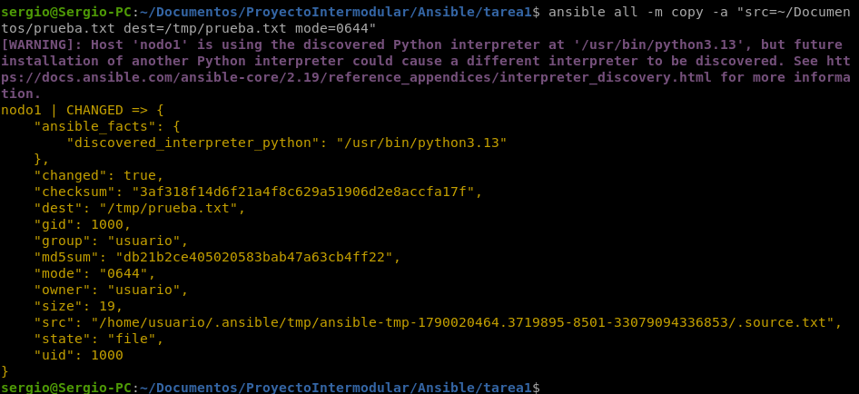


Ahora copiaremos de nuevo el mismo archivo para ver la importancia de la idempotencia en accion, Ansible deberia comprobar que el fichero ya existe con el mismo contenido y deberia no hacer nada reflejandolo en `changed=false` con el color del texto en verde

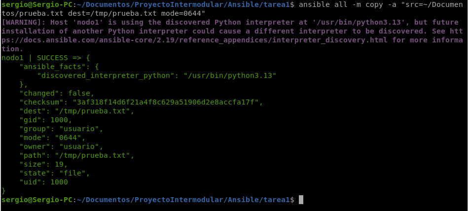

Ahora cambiaremos algo del contenido y volvemos a copiar

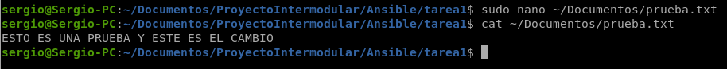

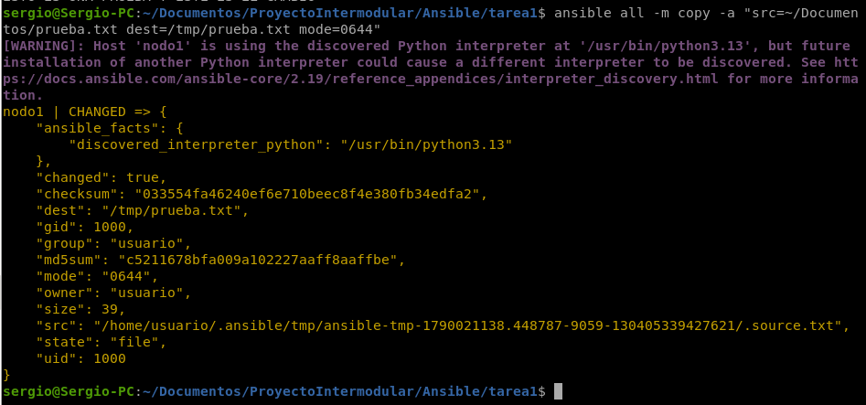

Y ahora si vamos a la MV veremos como ha cambiado el contenido pero no se han creado dos ficheros ni nada raro

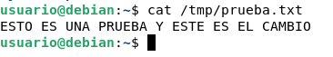

###### 7.3 Crear un directorio con file

```
ansible all -m file -a "path=/tmp/ansible_demo state=directory mode=0755"
```

- `-m file` gestiona ficheros, directorios y permisos en el nodo remoto.

- `path=/tmp/ansible_demo` es la ruta que queremos crear.

- `state=directory` indica que queremos un directorio, no un fichero.

- `mode=0755` establece permisos de lectura y ejecución para todos, y escritura solo para el propietario.

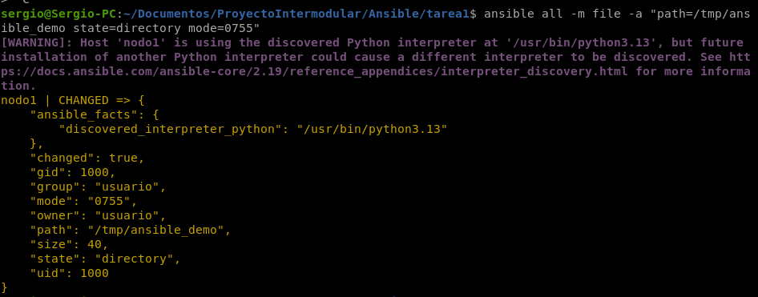

Para comprobar si se ha creado:

```
ansible nodo1 -m command -a "ls -ld /tmp/ansible_demo"
```

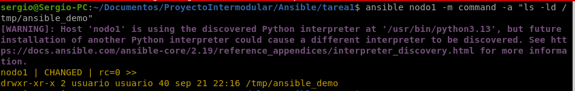

Como podemos ver el directorio se ha creado perfectamente y con los permisos que le hemos fijado en el comando.

###### 7.4 Instalar nginx con apt

Primera instalación:

```
ansible nodo1 -m apt -a "name=nginx state=present update_cache=yes" --become
```

- `-m apt` usa el módulo para gestionar paquetes en sistemas Debian/Ubuntu.

- `name=nginx` especifica el paquete a instalar.

- `state=present` indica que queremos que el paquete esté instalado.

- `update_cache=yes` actualiza la caché de paquetes antes de instalar (equivalente a `apt update`).

- `--become` ejecuta el comando con privilegios elevados (sudo), necesario para instalar paquetes.

Veremos `changed=true` porque se instala el paquete.

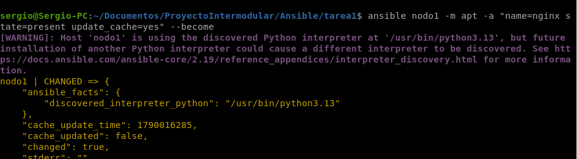

Segunda ejecución:

```
ansible nodo1 -m apt -a "name=nginx state=present" --become
```

Ahora veremos `changed=false` porque nginx ya está instalado y Ansible no necesita hacer nada.

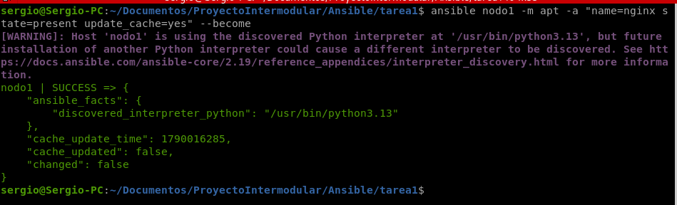

###### 7.5 Parar el servicio nginx

```
ansible nodo1 -m service -a "name=nginx state=stopped enabled=no" --become
```

- `-m service` gestiona servicios del sistema.

- `name=nginx` indica el servicio a controlar.

- `state=stopped` detiene el servicio si está en ejecución.

- `enabled=no` evita que el servicio se inicie automáticamente al arrancar el sistema.

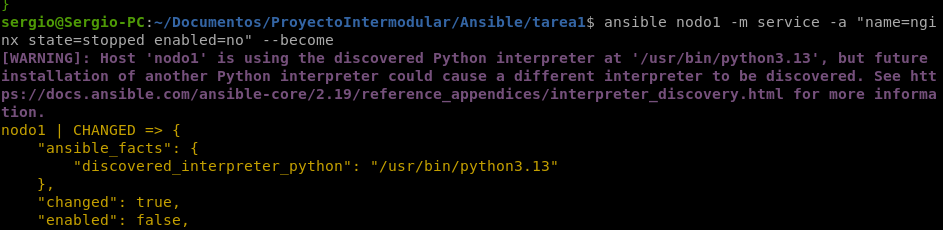

Comprobamos el estado:

```
ansible nodo1 -m command -a "systemctl is-active nginx" --become
```

- `systemctl is-active nginx` devuelve el estado actual del servicio (`active`, `inactive`, etc.).

Debe devolver `inactive`, confirmando que el servicio está parado.

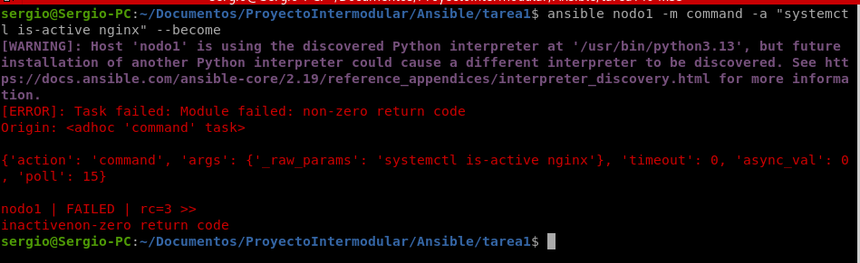

###### 7.6 Desinstalar nginx

```
ansible nodo1 -m apt -a "name=nginx state=absent" --become
```

- `state=absent` indica que queremos eliminar el paquete del sistema.

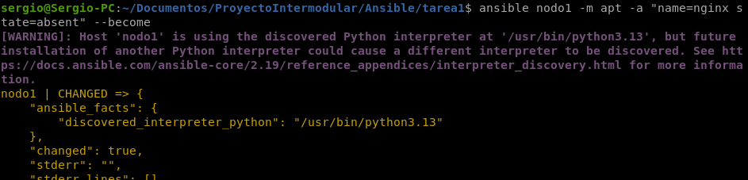

Comprobamos que ya no está:

```
ansible nodo1 -m command -a "which nginx"
```

- `which nginx` busca la ruta del ejecutable. Si no devuelve nada, el paquete se ha desinstalado correctamente.

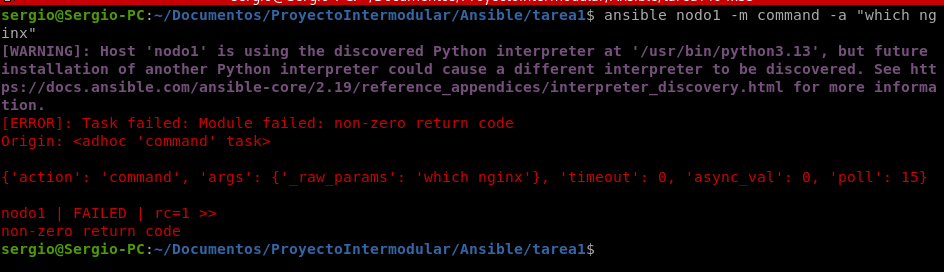

#### 8. Crear y eliminar un usuario

Creamos el usuario:

```
ansible all -m user -a "name=demo shell=/bin/bash state=present" --become
```

- `-m user` gestiona usuarios del sistema.

- `name=demo` es el nombre del usuario a crear.

- `shell=/bin/bash` asigna bash como shell por defecto.

- `state=present` indica que queremos que el usuario exista.

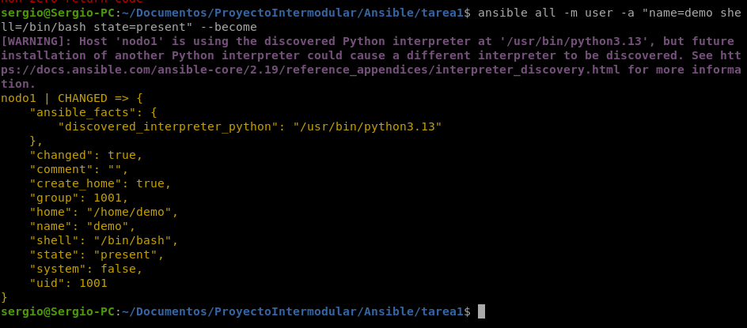

Comprobamos:

```
ansible nodo1 -m command -a "getent passwd demo"
```

- `getent passwd demo` busca el usuario en la base de datos del sistema y muestra su entrada completa.

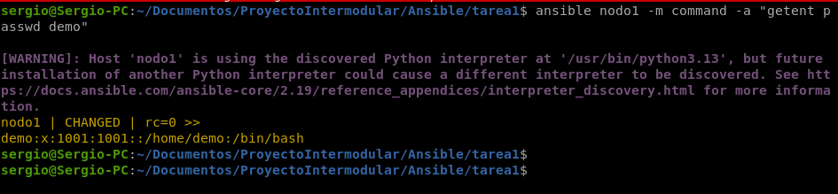

Eliminamos el usuario:

```
ansible all -m user -a "name=demo state=absent remove=yes" --become
```

- `state=absent` indica que queremos eliminar el usuario.

- `remove=yes` también borra el directorio home y los ficheros del usuario.

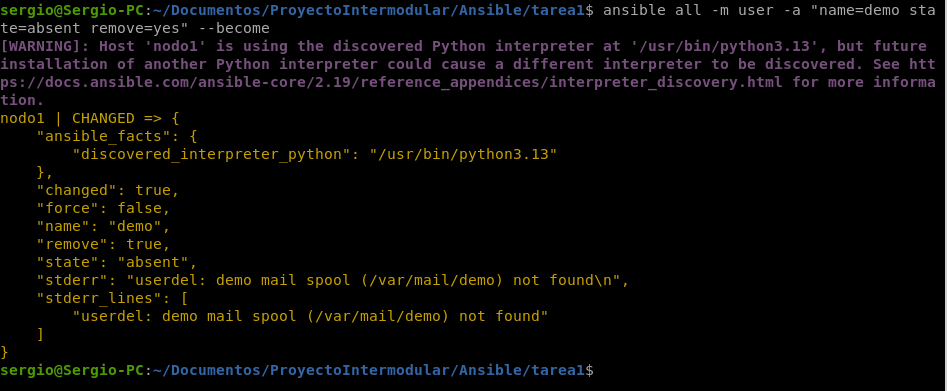

Comprobamos que ya no existe:

```
ansible nodo1 -m command -a "getent passwd demo"
```

Esta vez no debería devolver ninguna salida, confirmando que el usuario se ha eliminado.

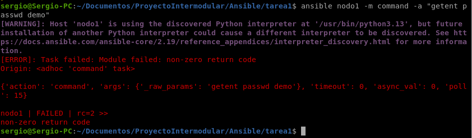


#### 8. Conclusión de la práctica

Con esta práctica he aprendido a configurar un entorno básico con Ansible para gestionar servidores remotos mediante SSH. He creado el inventario, configurado `ansible.cfg` y ejecutado comandos ad hoc con los módulos esenciales (`ping`, `command`, `copy`, `file`, `apt`, `service` y `user`).

Lo más importante ha sido entender la **idempotencia**: Ansible solo realiza cambios cuando el estado actual no coincide con el deseado, mostrando `changed=true` la primera vez y `changed=false` en ejecuciones posteriores.

También he practicado la gestión completa de un servicio web (instalar, parar y desinstalar nginx) y la administración de usuarios. Aunque algunos comandos han mostrado advertencias, he aprendido que no siempre indican errores reales, sino el comportamiento esperado del sistema.
