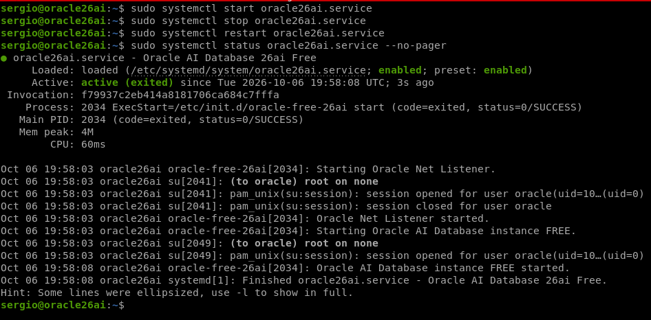
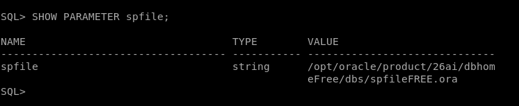
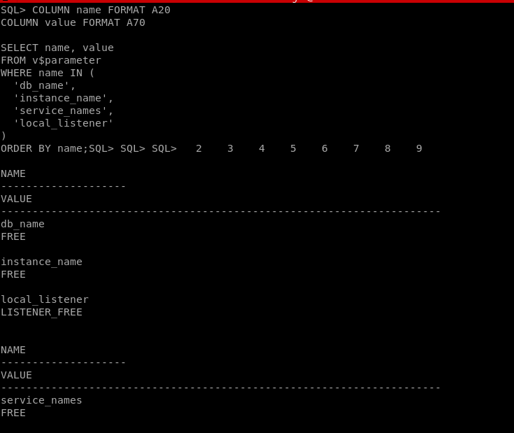
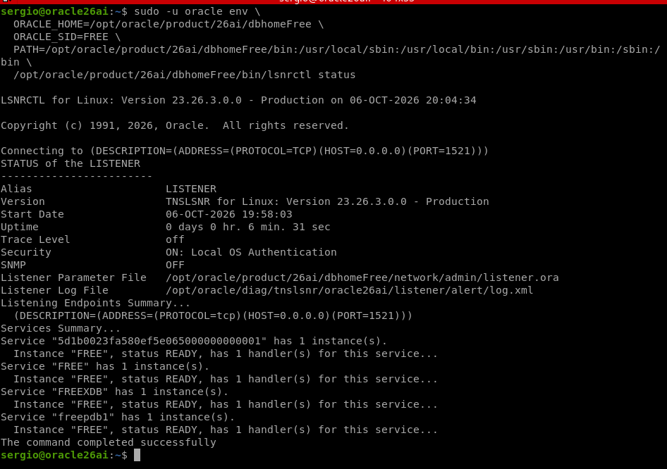
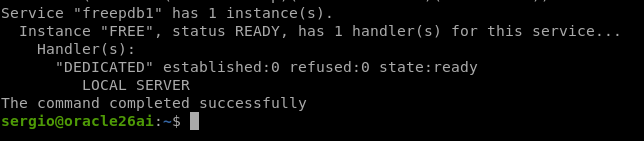
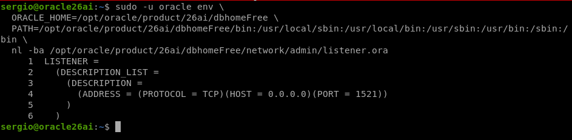
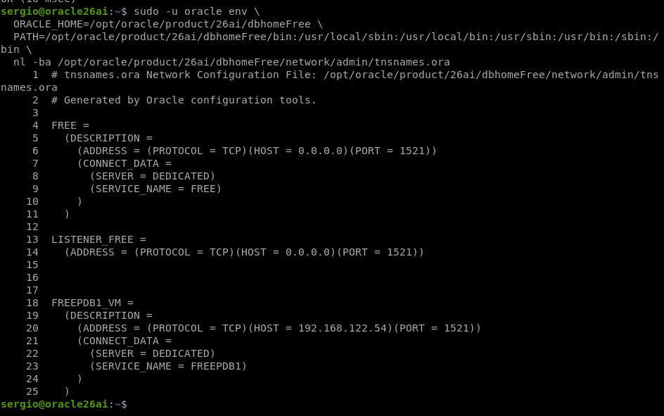
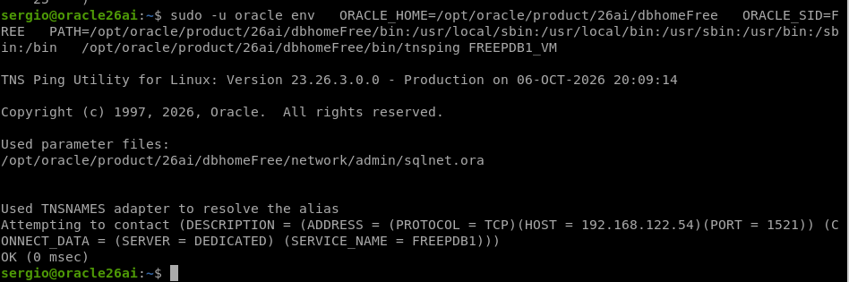

# Instalación de Oracle AI Database 26ai Free en una máquina virtual Debian 13 y conexión con SQL Developer

## 1. Objetivo

En esta práctica se instala y configura Oracle AI Database 26ai Free en una máquina virtual con Debian 13. Posteriormente se instala Oracle SQL Developer en el equipo host y se realiza una conexión remota a la base de datos.

La conexión final se realiza contra la PDB `FREEPDB1` usando la dirección IP `192.168.122.54`, el puerto `1521` y el nombre de servicio `FREEPDB1`.

---

## 2. Entorno utilizado

| Elemento              | Valor                        |
| --------------------- | ---------------------------- |
| Alumno                | Sergio Mesa                  |
| Fecha                 | 6 de octubre de 2026         |
| Equipo host           | Sergio-PC                    |
| Máquina virtual       | `oracle26ai`                 |
| Sistema de la VM      | Debian 13                    |
| Disco de la VM        | 50 GB                        |
| Dirección IP de la VM | `192.168.122.54`             |
| Base de datos         | Oracle AI Database 26ai Free |
| Base contenedora      | `FREE`                       |
| Base pluggable        | `FREEPDB1`                   |
| Puerto del listener   | `1521`                       |
| Cliente               | Oracle SQL Developer 26.2.0  |
| Java del host         | OpenJDK 21.0.12.1            |

---

## 3. Esquema de la conexión

```text
┌───────────────────────────────────┐
│ Equipo host: Sergio-PC            │
│                                   │
│ Oracle SQL Developer 26.2.0       │
└──────────────┬────────────────────┘
               │ TCP/IP
               │ 192.168.122.54:1521
               │ Servicio: FREEPDB1
               ▼
┌───────────────────────────────────┐
│ Máquina virtual: oracle26ai       │
│ Sistema: Debian 13                │
│                                   │
│ Oracle AI Database 26ai Free      │
│ CDB: FREE                         │
│ PDB: FREEPDB1                     │
│ Listener: puerto 1521             │
└───────────────────────────────────┘
```

---

## 4. Requisitos de la máquina virtual

Antes de instalar Oracle se comprueban los recursos de la máquina virtual y la configuración de red:

```bash
hostname
hostname -f
ip -br a
free -h
df -h /
```

La máquina virtual utilizada tiene 50 GB de disco y dispone de una IP accesible desde el host: `192.168.122.54`.

Para una instalación de prácticas se recomienda disponer de al menos 2 GB de RAM, 2 GB de swap y espacio libre suficiente en `/opt`.

Si no existe swap, se puede crear un fichero de 2 GB:

```bash
sudo fallocate -l 2G /swapfile
sudo chmod 600 /swapfile
sudo mkswap /swapfile
sudo swapon /swapfile
sudo sh -c 'echo "/swapfile swap swap defaults 0 0" >> /etc/fstab'
free -h
```

---

## 5. Preparación de Debian 13

Se actualiza el sistema e instalan las herramientas necesarias:

```bash
sudo apt update
sudo apt upgrade -y
sudo apt install -y alien libaio1 libnsl2 netcat-openbsd unzip
```

Se comprueba el nombre completo de la máquina virtual:

```bash
hostname
hostname -f
getent hosts "$(hostname -f)"
```

Si fuera necesario, se añade el nombre de la máquina al fichero `/etc/hosts`:

```bash
sudo nano /etc/hosts
```

Ejemplo de entrada para esta práctica:

```text
192.168.122.54 oracle26ai
```

---

## 6. Instalación de Oracle AI Database 26ai Free

Se descarga desde la página oficial de Oracle el paquete de Oracle AI Database 26ai Free para Linux de 64 bits y se guarda en el directorio de descargas de la máquina virtual.

```bash
cd ~/Descargas
ls -lh
```

Al trabajar con Debian 13, el paquete RPM se instala mediante `alien`:

```bash
cd ~/Descargas
sudo alien -i oracle-ai-database-free-26ai-*.rpm
```

Una vez terminada la instalación se comprueba que el software Oracle está disponible:

```bash
find /opt/oracle -type f -name sqlplus 2>/dev/null
dpkg -l | grep -i oracle
```

---

## 7. Configuración inicial de Oracle

Después de instalar el software se ejecuta el script de configuración:

```bash
sudo /etc/init.d/oracle-free-26ai configure
```

Durante este proceso se establece la contraseña de las cuentas administrativas de Oracle.

La configuración crea los siguientes elementos:

- La base contenedora `FREE`.
- La base pluggable `FREEPDB1`.
- El listener Oracle en el puerto `1521`.
- Los directorios y ficheros necesarios para la base de datos.

---

## 8. Servicio de arranque automático en Debian

### 8.1. Problema encontrado

El instalador de Oracle añade el script clásico:

```text
/etc/init.d/oracle-free-26ai
```

Este script permite arrancar y detener la base de datos manualmente:

```bash
sudo /etc/init.d/oracle-free-26ai start
sudo /etc/init.d/oracle-free-26ai stop
sudo /etc/init.d/oracle-free-26ai status
```

El arranque manual funciona y muestra un resultado similar a este:

```text
Starting Oracle Net Listener.
Oracle Net Listener started.
Starting Oracle AI Database instance FREE.
Oracle AI Database instance FREE started.
```

Sin embargo, al intentar habilitar directamente el script mediante systemd se obtiene el siguiente problema:

```bash
sudo systemctl is-enabled oracle-free-26ai
sudo systemctl is-active oracle-free-26ai
```

La salida muestra que el servicio aparece como `disabled` e `inactive`, aunque el script de inicio pueda arrancar Oracle manualmente.

El motivo es que `oracle-free-26ai` es un script SysV de `/etc/init.d/` y no una unidad systemd nativa. En Debian, el script no contiene la información de niveles de arranque que necesita `update-rc.d` para habilitarlo directamente.

Por ese motivo, este comando devuelve un error:

```bash
sudo systemctl enable oracle-free-26ai
```

```text
update-rc.d: error: oracle-free-26ai Default-Start contains no runlevels, aborting.
```

### 8.2. Solución: crear una unidad systemd propia

Se crea una unidad systemd llamada `oracle26ai.service`. Esta unidad utiliza el script original de Oracle para iniciar y detener la base de datos, pero permite a Debian habilitar el arranque automático correctamente.

Se crea el fichero de servicio:

```bash
sudo tee /etc/systemd/system/oracle26ai.service > /dev/null <<'EOF'
[Unit]
Description=Oracle AI Database 26ai Free
After=network-online.target
Wants=network-online.target

[Service]
Type=oneshot
RemainAfterExit=yes
ExecStart=/etc/init.d/oracle-free-26ai start
ExecStop=/etc/init.d/oracle-free-26ai stop
TimeoutStartSec=10min
TimeoutStopSec=10min

[Install]
WantedBy=multi-user.target
EOF
```

Se recarga systemd, se habilita el servicio y se inicia:

```bash
sudo systemctl daemon-reload
sudo systemctl enable oracle26ai.service
sudo systemctl start oracle26ai.service
```

Se comprueba el estado:

```bash
sudo systemctl is-enabled oracle26ai.service
sudo systemctl is-active oracle26ai.service
sudo systemctl status oracle26ai.service --no-pager
```

Resultado obtenido:

```text
enabled
active
```

El estado completo puede aparecer como:

```text
Active: active (exited)
```

Este estado es correcto. La unidad ejecuta el script de Oracle, el script arranca la instancia y el listener en segundo plano, y después termina. `RemainAfterExit=yes` mantiene la unidad marcada como activa.

A partir de este punto, la base de datos se gestiona con los siguientes comandos:

```bash
sudo systemctl start oracle26ai.service
sudo systemctl stop oracle26ai.service
sudo systemctl restart oracle26ai.service
sudo systemctl status oracle26ai.service --no-pager
```



## 9. Preparar el usuario Oracle

Se entra con el usuario `oracle`:

```bash
sudo su - oracle
```

Se cargan las variables del entorno de Oracle:

```bash
export ORACLE_HOME=/opt/oracle/product/26ai/dbhomeFree
export ORACLE_SID=FREE
export PATH="$ORACLE_HOME/bin:$PATH"
```

Se comprueba que SQL*Plus está disponible:

```bash
which sqlplus
sqlplus -v
```

Para cargar estas variables en futuras sesiones se añaden al perfil del usuario Oracle:

```bash
cat >> ~/.bash_profile <<'EOF'
export ORACLE_HOME=/opt/oracle/product/26ai/dbhomeFree
export ORACLE_SID=FREE
export PATH="$ORACLE_HOME/bin:$PATH"
EOF
```

Después se recarga el perfil:

```bash
source ~/.bash_profile
```

---

## 10. Comprobación de la base de datos

Como usuario `oracle`, se abre SQL*Plus como administrador:

```bash
sqlplus / as sysdba
```

Dentro de SQL*Plus se comprueba el estado de la base de datos:

```sql
SELECT name, open_mode
FROM v$database;
```

Se comprueba el estado de las PDB:

```sql
SHOW PDBS;
```

También se puede usar:

```sql
SELECT name, open_mode
FROM v$pdbs;
```

La PDB `FREEPDB1` debe aparecer en modo `READ WRITE`.

Si aparece cerrada, se abre y se guarda ese estado:

```sql
ALTER PLUGGABLE DATABASE FREEPDB1 OPEN;
ALTER PLUGGABLE DATABASE FREEPDB1 SAVE STATE;
```

---

## 11. Parámetros de arranque: SPFILE

El SPFILE es el fichero que Oracle utiliza para guardar los parámetros de arranque de la instancia.

Dentro de SQL*Plus, conectado como SYSDBA, se muestra el SPFILE que se está usando:

```sql
SHOW PARAMETER spfile;
```

La salida muestra una ruta parecida a:

```text
/opt/oracle/product/26ai/dbhomeFree/dbs/spfileFREE.ora
```



Se consultan los parámetros principales relacionados con la base de datos, la instancia y los servicios:

```sql
COLUMN name FORMAT A20
COLUMN value FORMAT A70

SELECT name, value
FROM v$parameter
WHERE name IN (
  'db_name',
  'instance_name',
  'service_names',
  'local_listener'
)
ORDER BY name;
```



| Parámetro        | Función                                                        |
| ---------------- | -------------------------------------------------------------- |
| `db_name`        | Nombre de la base contenedora, normalmente `FREE`              |
| `instance_name`  | Nombre de la instancia Oracle, normalmente `FREE`              |
| `service_names`  | Servicios que Oracle publica para aceptar conexiones           |
| `local_listener` | Listener local que utiliza Oracle para registrar sus servicios |

El servicio usado para conectarse a la base pluggable es `FREEPDB1`.

---

## 12. Configuración del listener

El listener es el proceso que recibe conexiones de red y las dirige al servicio Oracle solicitado.

La conexión de esta práctica utiliza:

```text
IP:        192.168.122.54
Puerto:    1521
Servicio:  FREEPDB1
```

Para evitar problemas con el entorno del usuario, el estado del listener se consulta desde el usuario `sergio` indicando el entorno de Oracle de forma explícita:

```bash
sudo -u oracle env \
  ORACLE_HOME=/opt/oracle/product/26ai/dbhomeFree \
  ORACLE_SID=FREE \
  PATH=/opt/oracle/product/26ai/dbhomeFree/bin:/usr/local/sbin:/usr/local/bin:/usr/sbin:/usr/bin:/sbin:/bin \
  /opt/oracle/product/26ai/dbhomeFree/bin/lsnrctl status
```



Para mostrar los servicios registrados:

```bash
sudo -u oracle env \
  ORACLE_HOME=/opt/oracle/product/26ai/dbhomeFree \
  ORACLE_SID=FREE \
  PATH=/opt/oracle/product/26ai/dbhomeFree/bin:/usr/local/sbin:/usr/local/bin:/usr/sbin:/usr/bin:/sbin:/bin \
  /opt/oracle/product/26ai/dbhomeFree/bin/lsnrctl services
```

En la salida debe aparecer el servicio `FREEPDB1`:

```text
Service "FREEPDB1" has 1 instance(s).
```



### 12.1. Fichero `listener.ora`

El fichero de configuración del listener suele estar en:

```text
$ORACLE_HOME/network/admin/listener.ora
```

Se muestra su contenido con:

```bash
sudo -u oracle env \
  ORACLE_HOME=/opt/oracle/product/26ai/dbhomeFree \
  PATH=/opt/oracle/product/26ai/dbhomeFree/bin:/usr/local/sbin:/usr/local/bin:/usr/sbin:/usr/bin:/sbin:/bin \
  nl -ba /opt/oracle/product/26ai/dbhomeFree/network/admin/listener.ora
```



Un fichero de listener básico puede tener esta estructura:

```text
LISTENER =
  (DESCRIPTION_LIST =
    (DESCRIPTION =
      (ADDRESS = (PROTOCOL = TCP)(HOST = oracle26ai)(PORT = 1521))
    )
  )
```

| Elemento            | Función                                  |
| ------------------- | ---------------------------------------- |
| `LISTENER`          | Nombre del proceso listener              |
| `PROTOCOL = TCP`    | Comunicación mediante TCP/IP             |
| `HOST = oracle26ai` | Máquina donde se ejecuta Oracle          |
| `PORT = 1521`       | Puerto utilizado para recibir conexiones |

---

## 13. Configuración de `tnsnames.ora`

`tnsnames.ora` permite definir alias de conexión para no repetir siempre la dirección IP, el puerto y el servicio de Oracle.

El fichero suele estar en:

```text
$ORACLE_HOME/network/admin/tnsnames.ora
```

Se muestra su contenido:

```bash
sudo -u oracle env \
  ORACLE_HOME=/opt/oracle/product/26ai/dbhomeFree \
  PATH=/opt/oracle/product/26ai/dbhomeFree/bin:/usr/local/sbin:/usr/local/bin:/usr/sbin:/usr/bin:/sbin:/bin \
  nl -ba /opt/oracle/product/26ai/dbhomeFree/network/admin/tnsnames.ora
```



Antes de modificarlo se crea una copia de seguridad:

```bash
sudo cp /opt/oracle/product/26ai/dbhomeFree/network/admin/tnsnames.ora \
  /opt/oracle/product/26ai/dbhomeFree/network/admin/tnsnames.ora.bak
```

Se edita el fichero con el usuario Oracle:

```bash
sudo -u oracle nano /opt/oracle/product/26ai/dbhomeFree/network/admin/tnsnames.ora
```

Al final del fichero se añade el alias de la máquina virtual:

```text
FREEPDB1_VM =
  (DESCRIPTION =
    (ADDRESS = (PROTOCOL = TCP)(HOST = 192.168.122.54)(PORT = 1521))
    (CONNECT_DATA =
      (SERVICE_NAME = FREEPDB1)
    )
  )
```

Se comprueba el alias con:

```bash
sudo -u oracle env \
  ORACLE_HOME=/opt/oracle/product/26ai/dbhomeFree \
  ORACLE_SID=FREE \
  PATH=/opt/oracle/product/26ai/dbhomeFree/bin:/usr/local/sbin:/usr/local/bin:/usr/sbin:/usr/bin:/sbin:/bin \
  /opt/oracle/product/26ai/dbhomeFree/bin/tnsping FREEPDB1_VM
```

El resultado correcto termina con una línea parecida a:

```text
OK (x msec)
```



| Campo          | Función                                            |
| -------------- | -------------------------------------------------- |
| `FREEPDB1_VM`  | Nombre corto elegido para la conexión              |
| `HOST`         | Dirección IP de la máquina virtual Oracle          |
| `PORT`         | Puerto del listener                                |
| `SERVICE_NAME` | Servicio de la PDB a la que se realiza la conexión |

---

## 14. Comprobación de red y firewall

Desde el equipo host se comprueba que la máquina virtual responde y que el puerto Oracle está disponible:

```bash
ping -c 3 192.168.122.54
nc -vz 192.168.122.54 1521
```

Si se utiliza `firewalld` dentro de la VM, se puede abrir el puerto 1521:

```bash
sudo firewall-cmd --permanent --add-port=1521/tcp
sudo firewall-cmd --reload
sudo firewall-cmd --list-ports
```

---

## 15. Instalación de Java y JavaFX en el host

En el equipo host se instala OpenJDK 21 y JavaFX:

```bash
sudo apt update
sudo apt install -y openjdk-21-jdk openjfx
```

Se comprueba la versión de Java:

```bash
/usr/lib/jvm/java-21-openjdk-amd64/bin/java -version
```

Resultado utilizado:

```text
openjdk version "21.0.12.1" 2026-08-18
OpenJDK Runtime Environment (build 21.0.12.1+1-1-deb13u1-Debian)
OpenJDK 64-Bit Server VM (build 21.0.12.1+1-1-deb13u1-Debian, mixed mode, sharing)
```

Se comprueba que JavaFX está instalado:

```bash
ls -l /usr/share/openjfx/lib/javafx.base.jar
```

---

## 16. Instalación y configuración de Oracle SQL Developer

Se descarga el archivo ZIP de Oracle SQL Developer para Linux y se extrae en el directorio de aplicaciones:

```bash
mkdir -p ~/Aplicaciones
cd ~/Descargas
unzip sqldeveloper-*.zip -d ~/Aplicaciones
```

Se comprueba la ruta del script principal:

```bash
find ~/Aplicaciones -type f -name sqldeveloper.sh
```

La ruta utilizada es:

```text
$HOME/Aplicaciones/sqldeveloper/sqldeveloper.sh
```

### 16.1. Configuración del JDK

Se edita el fichero de SQL Developer:

```bash
nano "$HOME/Aplicaciones/sqldeveloper/sqldeveloper/bin/jdk.conf"
```

Se deja activa la siguiente línea:

```text
SetJavaHome /usr/lib/jvm/java-21-openjdk-amd64
```

### 16.2. Configuración de JavaFX

Durante el inicio de SQL Developer apareció este error:

```text
java.lang.module.FindException: Module javafx.base not found
```

Para solucionarlo se edita el launcher:

```bash
nano "$HOME/Aplicaciones/sqldeveloper/ide/bin/launcher.sh"
```

Se localizan las líneas:

```bash
CheckJDK
CheckLibraryPath
AppendVMSpecificOptions
AppendCommandlineVMOptions
```

Justo después de `AppendCommandlineVMOptions` se añaden:

```bash
# JavaFX modules for Java 21
AddVMOption --module-path=/usr/share/openjfx/lib
AddVMOption --add-modules=javafx.controls,javafx.fxml,javafx.web,javafx.swing
```

### 16.3. Lanzador local de SQL Developer

Se crea el comando `sqldeveloper`:

```bash
mkdir -p ~/.local/bin

cat > ~/.local/bin/sqldeveloper <<'EOF'
#!/bin/sh

export JAVA_HOME=/usr/lib/jvm/java-21-openjdk-amd64
export PATH="$JAVA_HOME/bin:$PATH"

exec "$HOME/Aplicaciones/sqldeveloper/sqldeveloper.sh" "$@"
EOF

chmod +x ~/.local/bin/sqldeveloper
```

Se comprueba la ruta:

```bash
command -v sqldeveloper
```

La ruta obtenida es:

```text
/home/sergio/.local/bin/sqldeveloper
```

Se inicia SQL Developer:

```bash
sqldeveloper
```

---

## 17. Conexión desde SQL Developer

Se crea una conexión nueva con los siguientes datos:

| Campo               | Valor                                                  |
| ------------------- | ------------------------------------------------------ |
| Nombre de conexión  | `Oracle-VM`                                            |
| Usuario             | `SYSTEM`                                               |
| Contraseña          | Contraseña definida durante la configuración de Oracle |
| Tipo de conexión    | Básico                                                 |
| Nombre del host     | `192.168.122.54`                                       |
| Puerto              | `1521`                                                 |
| Método de conexión  | **Nombre del Servicio**                                |
| Nombre del servicio | `FREEPDB1`                                             |
| Rol                 | Predeterminado                                         |

Se pulsa **Probar** y, cuando el resultado es correcto, se pulsa **Conectar**.

En una primera prueba se utilizó el SID `xe`, lo que produjo este error:

```text
ORA-12505: No se puede conectar a la base de datos.
El SID xe no está registrado con el listener.
```

La solución fue seleccionar **Nombre del Servicio** y utilizar `FREEPDB1`.

---

## 18. Validación final

Una vez conectado desde SQL Developer se ejecuta:

```sql
SELECT
  SYS_CONTEXT('USERENV', 'DB_NAME') AS base_datos,
  SYS_CONTEXT('USERENV', 'SERVICE_NAME') AS servicio,
  SYS_CONTEXT('USERENV', 'SERVER_HOST') AS servidor,
  USER AS usuario
FROM dual;
```

Resultado obtenido:

| BASE_DATOS | SERVICIO   | SERVIDOR     | USUARIO  |
| ---------- | ---------- | ------------ | -------- |
| `FREEPDB1` | `freepdb1` | `oracle26ai` | `SYSTEM` |

La consulta confirma que SQL Developer se conecta correctamente desde el host a la base pluggable `FREEPDB1`, alojada en la máquina virtual `oracle26ai`.

---

## 19. Problemas frecuentes

### `ORA-12505`

Este error aparece cuando se utiliza un SID incorrecto, como `xe`.

Solución: seleccionar **Nombre del Servicio** y utilizar:

```text
FREEPDB1
```

### `ORA-12514`

Este error aparece cuando el listener no conoce el servicio solicitado.

Como SYSDBA se puede ejecutar:

```sql
ALTER PLUGGABLE DATABASE FREEPDB1 OPEN;
ALTER PLUGGABLE DATABASE FREEPDB1 SAVE STATE;
ALTER SYSTEM REGISTER;
```

Después se revisa:

```bash
lsnrctl services
```

### `TNS-12541: No listener`

Este error indica que el listener no está disponible en el host o puerto utilizado.

Se comprueba el servicio Oracle:

```bash
sudo systemctl status oracle26ai.service --no-pager
```

Se comprueba el listener con el entorno de Oracle:

```bash
sudo -u oracle env \
  ORACLE_HOME=/opt/oracle/product/26ai/dbhomeFree \
  ORACLE_SID=FREE \
  PATH=/opt/oracle/product/26ai/dbhomeFree/bin:/usr/local/sbin:/usr/local/bin:/usr/sbin:/usr/bin:/sbin:/bin \
  /opt/oracle/product/26ai/dbhomeFree/bin/lsnrctl status
```

### `Module javafx.base not found`

Este error se produce cuando SQL Developer no encuentra los módulos JavaFX.

Solución:

```bash
sudo apt install -y openjfx
```

Y añadir al launcher:

```bash
AddVMOption --module-path=/usr/share/openjfx/lib
AddVMOption --add-modules=javafx.controls,javafx.fxml,javafx.web,javafx.swing
```

### No se puede conectar al puerto 1521

Desde el host se realizan estas comprobaciones:

```bash
ping -c 3 192.168.122.54
nc -vz 192.168.122.54 1521
```

Dentro de la VM se revisa:

```bash
sudo systemctl status oracle26ai.service --no-pager
ss -ltnp | grep 1521
```

---

## 20. Conclusión

Oracle AI Database 26ai Free se ha instalado y configurado en una máquina virtual Debian 13. La base dispone de la CDB `FREE`, la PDB `FREEPDB1` y un listener configurado en el puerto `1521`.

Como el script de inicio instalado por Oracle no se pudo habilitar directamente con systemd en Debian, se creó la unidad `oracle26ai.service`. Esta unidad utiliza el script original de Oracle y permite que la base de datos se inicie automáticamente al arrancar la máquina virtual.

Oracle SQL Developer se configuró en el equipo host usando OpenJDK 21 y JavaFX. La conexión se realizó con la dirección `192.168.122.54`, el puerto `1521` y el nombre de servicio `FREEPDB1`.

---

## 21. Referencias

- Oracle, [Oracle AI Database Free Installation Guide, 26ai for Linux](https://docs.oracle.com/en/database/oracle/oracle-database/26/xeinl/index.html).
- Oracle, [Starting and Stopping Oracle AI Database Free](https://docs.oracle.com/en/database/oracle/oracle-database/26/xeinl/starting-and-stopping-oracle-database.html).
- Oracle, [Connecting to Oracle Database Free](https://docs.oracle.com/en/database/oracle/oracle-database/23/xeinl/connecting-oracle-database-free.html).
- Oracle, [Installing and Starting SQL Developer](https://docs.oracle.com/en/database/oracle/sql-developer/26.2/rptig/installing-and-starting-sql-developer.html).
