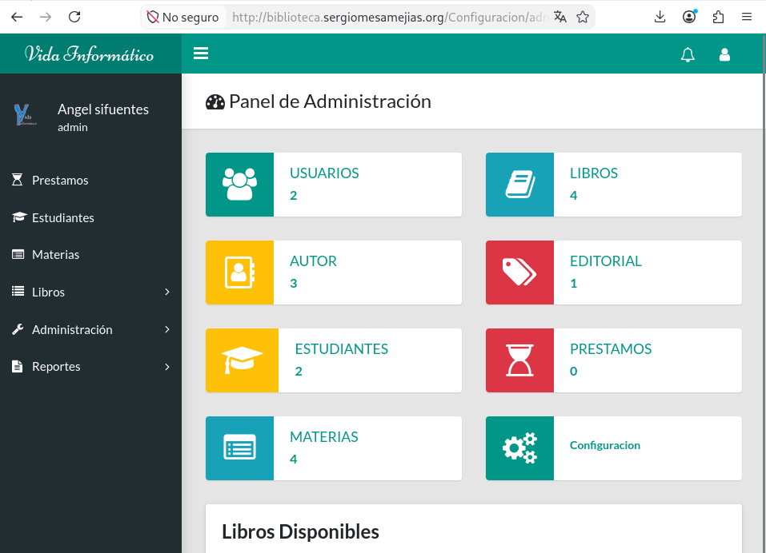
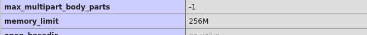

# Práctica: instalación de una aplicación PHP — Biblioteca

**Alumno:** Sergio Mesa Mejías  
**Servidor:** `app-web`  
**Dirección IP del servidor:** `192.168.122.198`  
**Dominio configurado:** `biblioteca.sergiomesamejias.org`  

## 1. Introducción

En esta práctica he instalado y configurado la aplicación web **Biblioteca**, una aplicación desarrollada en PHP y MariaDB para gestionar préstamos de una biblioteca. La aplicación se descargó desde el repositorio proporcionado y se publicó mediante Apache en un Virtual Host propio.

Repositorio utilizado:

```text
https://github.com/VidaInformatico/Sistema-de-biblioteca-basico-php-8-y-mysql
```

La URL final configurada fue:

```text
http://biblioteca.sergiomesamejias.org/
```

## 2. Comprobaciones previas

Antes de iniciar la instalación comprobé la dirección IP del servidor y el estado de Apache y MariaDB.

```bash
hostname -I
```

Salida obtenida:

```text
192.168.122.198
```

Comprobé Apache:

```bash
sudo systemctl status apache2 --no-pager
```

Resultado relevante:

```text
Active: active (running)
```

Comprobé MariaDB:

```bash
sudo systemctl status mariadb --no-pager
```

Resultado relevante:

```text
Active: active (running)
```

Comprobé la versión de PHP:

```bash
php -v
```

Salida relevante:

```text
PHP 8.4.26
```

También comprobé Git:

```bash
git --version
```

Salida:

```text
git version 2.47.3
```

## 3. Descarga de la aplicación

Descargué el código fuente de la aplicación utilizando Git:

```bash
cd ~
git clone https://github.com/VidaInformatico/Sistema-de-biblioteca-basico-php-8-y-mysql.git
cd ~/Sistema-de-biblioteca-basico-php-8-y-mysql
```

Comprobé los archivos de la aplicación:

```bash
ls -la
```

Los elementos principales encontrados fueron:

```text
.htaccess
Assets
Config
Controllers
Libraries
Models
Views
biblioteca.sql
index.php
README.md
```

Localicé el fichero del esquema de la base de datos:

```bash
find . -iname "*.sql"
```

Salida:

```text
./biblioteca.sql
```

También revisé la configuración original:

```bash
cat Config/Config.php
```

Configuración original:

```php
<?php
const base_url = "http://localhost/biblio/";
const host = "localhost";
const user = "root";
const pass = "";
const db = "biblioteca";
const charset = "charset=utf8";
?>
```

## 4. Creación de la base de datos

Accedí a MariaDB como administrador:

```bash
sudo mariadb
```

Creé la base de datos `biblioteca` con codificación UTF-8:

```sql
CREATE DATABASE biblioteca CHARACTER SET utf8mb4 COLLATE utf8mb4_unicode_ci;
```

Creé un usuario específico para la aplicación:

```sql
CREATE USER 'biblioteca_user'@'localhost' IDENTIFIED BY 'biblioteca123';
```

Concedí permisos sobre la base de datos:

```sql
GRANT ALL PRIVILEGES ON biblioteca.* TO 'biblioteca_user'@'localhost';
```

Actualicé los privilegios y salí de MariaDB:

```sql
FLUSH PRIVILEGES;
EXIT;
```

Los datos de conexión utilizados fueron:

| Parámetro     | Valor             |
| ------------- | ----------------- |
| Host          | `localhost`       |
| Base de datos | `biblioteca`      |
| Usuario       | `biblioteca_user` |
| Contraseña    | `biblioteca123`   |

## 5. Importación del esquema SQL

Comprobé que el archivo SQL existía:

```bash
ls -l biblioteca.sql
```

Salida:

```text
-rw-rw-r-- 1 sergio sergio 10781 Oct 9 10:33 biblioteca.sql
```

Importé el esquema de la aplicación:

```bash
mariadb -u biblioteca_user -p biblioteca < biblioteca.sql
```

El comando terminó sin errores, por lo que la importación se realizó correctamente.

Accedí a la base de datos:

```bash
mariadb -u biblioteca_user -p biblioteca
```

Comprobé las tablas:

```sql
SHOW TABLES;
```

Salida obtenida:

```text
+----------------------+
| Tables_in_biblioteca |
+----------------------+
| autor                |
| configuracion        |
| detalle_permisos     |
| editorial            |
| estudiante           |
| libro                |
| materia              |
| permisos             |
| prestamo             |
| usuarios             |
+----------------------+
10 rows in set
```

Comprobé los usuarios iniciales de la aplicación:

```sql
SELECT * FROM usuarios;
```

Salida obtenida:

```text
+----+---------+------------------+------------------------------------------------------------------+--------+
| id | usuario | nombre           | clave                                                            | estado |
+----+---------+------------------+------------------------------------------------------------------+--------+
|  1 | admin   | Angel sifuentes  | 8c6976e5b5410415bde908bd4dee15dfb167a9c873fc4bb8a81f6f2ab448a918 |      1 |
|  2 | angel   | Vida Informatico | 519ba91a5a5b4afb9dc66f8805ce8c442b6576316c19c6896af2fa9bda6aff71 |      1 |
+----+---------+------------------+------------------------------------------------------------------+--------+
```

Se comprobó que existe el usuario inicial `admin`, que permite iniciar sesión en la aplicación con la contraseña `admin`.

## 6. Copia al DocumentRoot

Creé el directorio base de la aplicación:

```bash
sudo mkdir -p /var/www/biblioteca
```

Copié todos los archivos de la aplicación al directorio web. El punto final permite copiar también archivos ocultos como `.htaccess`:

```bash
sudo cp -a . /var/www/biblioteca/
```

Asigné el propietario de los archivos al usuario utilizado por Apache:

```bash
sudo chown -R www-data:www-data /var/www/biblioteca
```

Apliqué permisos a directorios y archivos:

```bash
sudo find /var/www/biblioteca -type d -exec chmod 755 {} \;
sudo find /var/www/biblioteca -type f -exec chmod 644 {} \;
```

## 7. Configuración de la aplicación

Modifiqué el archivo de configuración de la aplicación:

```bash
sudo nano /var/www/biblioteca/Config/Config.php
```

El contenido final fue:

```php
<?php
const base_url = "http://biblioteca.sergiomesamejias.org/";
const host = "localhost";
const user = "biblioteca_user";
const pass = "biblioteca123";
const db = "biblioteca";
const charset = "charset=utf8";
?>
```

Comprobé que el archivo no tenía errores de sintaxis:

```bash
sudo php -l /var/www/biblioteca/Config/Config.php
```

Salida obtenida:

```text
No syntax errors detected in /var/www/biblioteca/Config/Config.php
```

## 8. Activación de mod_rewrite

Comprobé el contenido de `.htaccess`:

```bash
sudo cat /var/www/biblioteca/.htaccess
```

Contenido:

```apache
RewriteEngine on
RewriteCond %{REQUEST_FILENAME} !-d
RewriteCond %{REQUEST_FILENAME} !-f
RewriteRule ^(.*)$ index.php?url=$1 [QSA,L]
```

Activé el módulo `rewrite` de Apache:

```bash
sudo a2enmod rewrite
```

Este módulo permite que Apache aplique las reglas de reescritura definidas en el archivo `.htaccess`.

## 9. Configuración del Virtual Host

Creé el fichero de configuración del Virtual Host:

```bash
sudo nano /etc/apache2/sites-available/biblioteca.sergiomesamejias.org.conf
```

Contenido del fichero:

```apache
<VirtualHost *:80>
    ServerName biblioteca.sergiomesamejias.org

    DocumentRoot /var/www/biblioteca

    <Directory /var/www/biblioteca>
        Options FollowSymLinks
        AllowOverride All
        Require all granted
    </Directory>

    ErrorLog ${APACHE_LOG_DIR}/biblioteca-error.log
    CustomLog ${APACHE_LOG_DIR}/biblioteca-access.log combined
</VirtualHost>
```

Activé el sitio:

```bash
sudo a2ensite biblioteca.sergiomesamejias.org.conf
```

## 10. Configuración de AllowOverride

Para permitir que Apache interpretara el archivo `.htaccess`, modifiqué el fichero global de configuración:

```bash
sudo nano /etc/apache2/apache2.conf
```

Dentro del bloque del directorio `/var/www/`, cambié:

```apache
AllowOverride None
```

por:

```apache
AllowOverride All
```

El bloque quedó así:

```apache
<Directory /var/www/>
    Options Indexes FollowSymLinks
    AllowOverride All
    Require all granted
</Directory>
```

Comprobé el cambio:

```bash
sudo grep -n -A 8 -B 2 '<Directory /var/www/' /etc/apache2/apache2.conf
```

Salida relevante:

```text
170:<Directory /var/www/>
171-Options Indexes FollowSymLinks
172-AllowOverride All
173-Require all granted
174-</Directory>
```

## 11. Validación y reinicio de Apache

Comprobé la sintaxis de Apache:

```bash
sudo apache2ctl configtest
```

Salida:

```text
Syntax OK
```

Reinicié Apache para aplicar todos los cambios:

```bash
sudo systemctl restart apache2
```

Comprobé el estado del servicio:

```bash
sudo systemctl status apache2 --no-pager
```

Resultado relevante:

```text
Active: active (running)
```

## 12. Configuración del cliente

Como no se utilizó un servidor DNS, configuré resolución estática en el equipo cliente editando el archivo `/etc/hosts`:

```bash
sudo nano /etc/hosts
```

Añadí esta línea:

```text
192.168.122.198 biblioteca.sergiomesamejias.org
```

De este modo, el nombre `biblioteca.sergiomesamejias.org` se resuelve hacia la dirección IP privada del servidor web.

## 13. Acceso a la aplicación

Accedí desde el navegador a la siguiente URL:

```text
http://biblioteca.sergiomesamejias.org/
```

Utilicé las credenciales iniciales:

```text
Usuario: admin
Contraseña: admin
```

El acceso fue correcto. Con ello comprobé que Apache, PHP, MariaDB, el Virtual Host, la resolución estática y las reglas de reescritura funcionaban correctamente.

> ## CAPTURA 1 — Acceso y login correcto
> 
> Inserta aquí una captura donde se vea la URL `http://biblioteca.sergiomesamejias.org/` y la pantalla de inicio de sesión o el panel de administración después de acceder con el usuario `admin`.



## 14. Cambio de `memory_limit`

El enunciado solicitaba aumentar a 256 MB la memoria máxima disponible para un script PHP.

Como la aplicación se ejecuta mediante Apache con PHP 8.4, el fichero correcto que tuve que modificar fue:

```text
/etc/php/8.4/apache2/php.ini
```

> No se debe modificar `/etc/php/8.4/cli/php.ini`, ya que ese fichero solo afecta a los scripts PHP ejecutados desde la terminal.

Comprobé el valor inicial:

```bash
sudo grep -n '^memory_limit' /etc/php/8.4/apache2/php.ini
```

Salida inicial:

```text
435:memory_limit = 128M
```

Edité el fichero:

```bash
sudo nano /etc/php/8.4/apache2/php.ini
```

Cambié la directiva:

```ini
memory_limit = 128M
```

por:

```ini
memory_limit = 256M
```

Comprobé que el cambio se realizó correctamente:

```bash
sudo grep -n '^memory_limit' /etc/php/8.4/apache2/php.ini
```

Salida obtenida:

```text
435:memory_limit = 256M
```

Reinicié Apache para que PHP aplicara la nueva configuración:

```bash
sudo systemctl restart apache2
```

## 15. Comprobación con `info.php`

Creé temporalmente un archivo PHP con la función `phpinfo()`:

```bash
echo '<?php phpinfo(); ?>' | sudo tee /var/www/biblioteca/info.php
sudo chown www-data:www-data /var/www/biblioteca/info.php
sudo chmod 644 /var/www/biblioteca/info.php
```

Accedí desde el navegador a:

```text
http://biblioteca.sergiomesamejias.org/info.php
```

En la página de información de PHP busqué la directiva `memory_limit` y comprobé que mostraba el valor `256M`.

> ## CAPTURA 2 — Comprobación de `memory_limit`
> 
> Inserta aquí una captura de la URL `http://biblioteca.sergiomesamejias.org/info.php` donde se vea la fila `memory_limit` con el valor `256M` en las columnas **Local Value** y **Master Value**.



```text

```

Una vez hecha la comprobación, eliminé `info.php` por seguridad:

```bash
sudo rm /var/www/biblioteca/info.php
```

## 16. Conclusión

En esta práctica he desplegado correctamente la aplicación Biblioteca en un servidor Apache con PHP y MariaDB. He creado la base de datos `biblioteca`, el usuario `biblioteca_user`, importado las tablas desde `biblioteca.sql` y configurado la aplicación con las credenciales de acceso correspondientes.

También he configurado el Virtual Host `biblioteca.sergiomesamejias.org`, activado el módulo `rewrite`, permitido la lectura de `.htaccess` mediante `AllowOverride All` y añadido la resolución estática en el cliente.

Finalmente, he accedido correctamente a la aplicación utilizando el usuario `admin` y he cambiado la directiva `memory_limit` de PHP de `128M` a `256M`, verificando el cambio con el archivo temporal `info.php`.
