# Práctica GitHub – Sergio Mesa

> **Alumno:** Sergio Mesa  
> **Curso:** 2ASIR  
> **Fecha:** 24/09/2026  
> **Objetivo:** En esta práctica hemos configurado GitHub para usar SSH, creado y clonado repositorios, subido archivos y utilizado sintaxis Markdown en un README.

---

## 1. Configuración de GitHub

### 1.1. Creación de la cuenta

Primero he creado una cuenta en GitHub accediendo a la siguiente dirección:

[https://github.com](https://github.com)

Una vez creada la cuenta de GitHub vamos a continuar generando y copiando nuestra clave SSH en GitHub

### 1.2. Generación de la clave H

Para poder conectarnos a GitHub mediante SSH, he comprobado primero si ya tenía una clave pública RSA creada:

```bash
ls -l ~/.ssh/
```

En caso de no tener los archivos `id_rsa` e `id_rsa.pub`, hay que generar una clave nueva con el siguiente comando:

```bash
ssh-keygen -t rsa -b 4096 -C "sergiomesamejias@gmail.com"
```

En mi caso, yo ya tengo los archivos de mi clave publica/privada entonces no voy a generar otra.

### 1.3. Copia de la clave pública

Después, he mostrado el contenido de mi clave pública con este comando:

```bash
cat ~/.ssh/id_rsa.pub
```

He copiado la línea completa mostrada en pantalla, que empieza por `ssh-rsa` y termina normalmente con un comentario, como mi correo electrónico.

>  Salida del comando `cat ~/.ssh/id_rsa.pub`.  
> 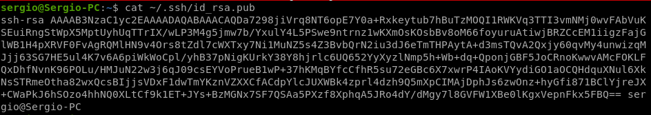


### 1.4. Añadir la clave SSH a GitHub

Desde mi perfil de GitHub he seguido estos pasos:

1. He pulsado sobre mi foto de perfil y he entrado en **Settings**.
2. He accedido al apartado **SSH and GPG keys**.
3. He pulsado en **New SSH key**.
4. He escrito un nombre identificativo para mi ordenador.
5. He pegado la clave pública RSA que había copiado anteriormente.
6. Finalmente, hemos guardado la clave pulsando en **Add SSH key**.

> Clave SSH añadida a mi perfil de GitHub.  
> 

---

### 1.5. Comprobar conexión SSH

He comprobado que GitHub reconoce correctamente mi clave usando el siguiente comando:

```bash
ssh -T git@github.com
```

La primera vez es posible que aparezca una pregunta para confirmar la huella del servidor. En ese caso, he escrito `yes`.

El mensaje esperado debe indicar que la autenticación se ha realizado correctamente, aunque GitHub no proporciona acceso a una shell remota.

> Comprobación de la conexión SSH con GitHub.  
> 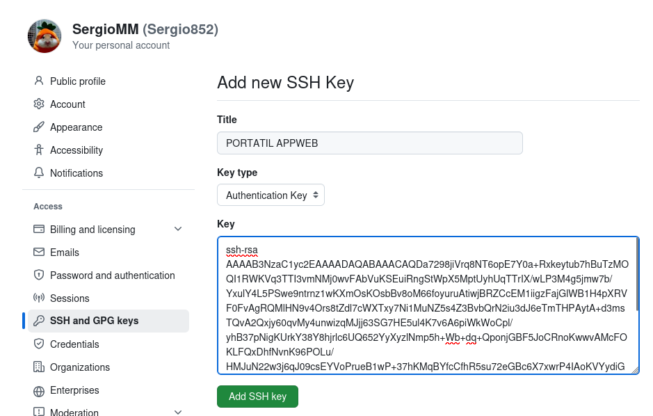

---

## 2. Primer repositorio: `prueba_sergio_mesa`

### 2.1. Creación del repositorio remoto

En GitHub he creado un repositorio nuevo con estos datos:

| Campo                  | Valor introducido             |
| ---------------------- | ----------------------------- |
| Nombre del repositorio | `prueba_sergio_mesa`          |
| Descripción            | `Repositorio de prueba 2ASIR` |
| Inicialización         | README habilitado             |
| Visibilidad            | Pública                       |

>  Formulario de creación del repositorio `prueba_sergio_mesa`.  
> 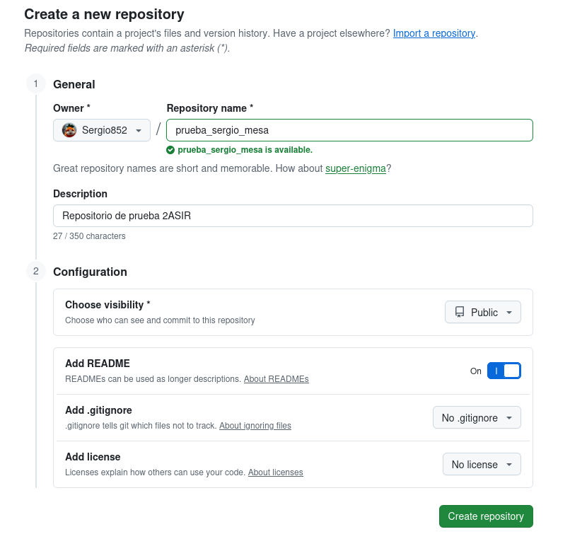

>  Repositorio recién creado en GitHub.  
> 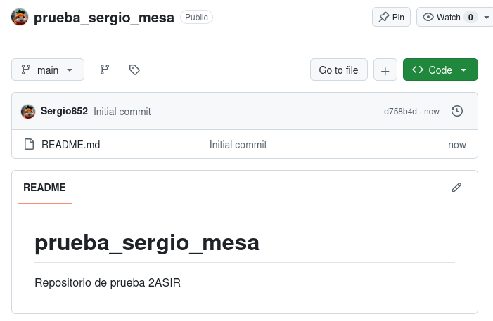

---

### 2.2. Copiar la URL SSH

Una vez creado el repositorio, he pulsado el botón verde **Code**, he seleccionado la pestaña **SSH** y he copiado la URL SSH. La URL tiene un formato similar a este:

```text
git@github.com:USUARIO_GITHUB/prueba_sergio_mesa.git
```

> **Importante:** He utilizado la URL SSH y no la URL HTTPS.

> URL SSH del repositorio copiada desde GitHub.  
> 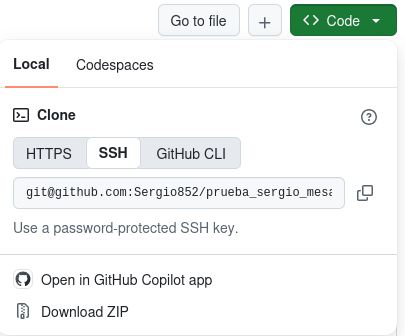

---

### 2.3. Clonar el repositorio

He creado una carpeta para guardar mis prácticas de GitHub y he clonado el repositorio remoto mediante SSH:

```bash
cd ~
mkdir -p github_practicas
cd github_practicas
git clone git@github.com:USUARIO_GITHUB/prueba_sergio_mesa.git
```

A continuación, he entrado en la carpeta clonada:

```bash
cd prueba_sergio_mesa
```

>  Clonado del repositorio mediante SSH.  
> 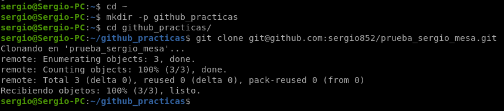

---

### 2.4. Comprobación de la URL remota

Para comprobar que hemos configurado el repositorio utilizando SSH, he mostrado el contenido del archivo `.git/config`:

```bash
cat .git/config
```

En la sección `[remote "origin"]` debe aparecer una línea similar a la siguiente:

```ini
url = git@github.com:sergio852/prueba_sergio_mesa.git
```

También he comprobado el repositorio remoto con:

```bash
git remote -v
```

> Contenido de `.git/config` y salida de `git remote -v`.  
> 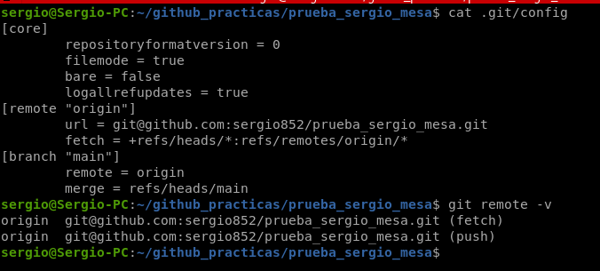

---

### 2.5. Comprobación del README

El repositorio se inicializó con un archivo llamado `README.md`. He comprobado que existe y he mostrado su contenido:

```bash
ls -la
cat README.md
```

Este archivo sirve para describir el proyecto y se muestra automáticamente en la página principal del repositorio de GitHub.

>  Archivo `README.md` dentro del repositorio local.  
> 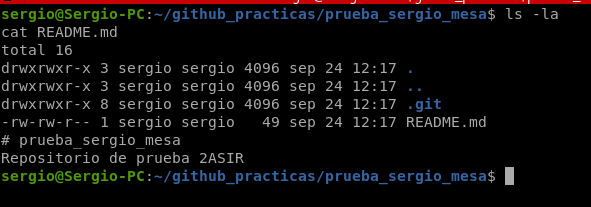

---

## 3. Creación y modificación de archivos

### 3.1. Crear carpetas, subcarpetas y archivos

Dentro del repositorio `prueba_sergio_mesa`, he creado varias carpetas y archivos para comprobar el flujo de trabajo con Git:

```bash
mkdir -p documentos/apuntes
mkdir -p codigo

echo "Estos son mis apuntes de Git y GitHub." > documentos/apuntes/git.txt
echo "print('Hola desde Python')" > codigo/ejemplo.py
echo "# Documento adicional" > documento_adicional.md
```

Después, he comprobado la estructura creada:

```bash
tree github_practicas/
```

> Creación de carpetas, subcarpetas y archivos.  
> 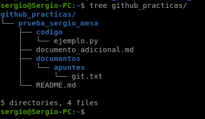

---

### 3.2. Consultar el estado del repositorio

Antes de guardar los cambios, he ejecutado:

```bash
git status
```

Con este comando podemos ver que Git detecta los archivos nuevos como archivos no rastreados (*untracked files*).

> Estado del repositorio antes de añadir los archivos.  
> 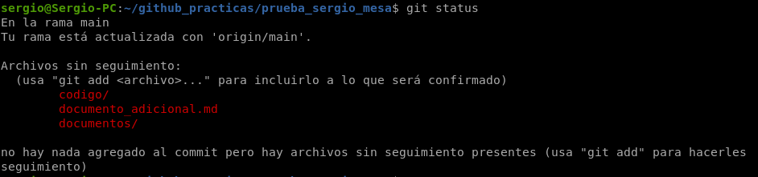

---

### 3.3. Añadir archivos al área de preparación

He añadido todos los cambios al área de preparación o *staging area*:

```bash
git add .
```

Después, hemos comprobado de nuevo el estado:

```bash
git status
```

Ahora los archivos deben aparecer preparados para el siguiente commit.

> Archivos añadidos con `git add .`.  
> 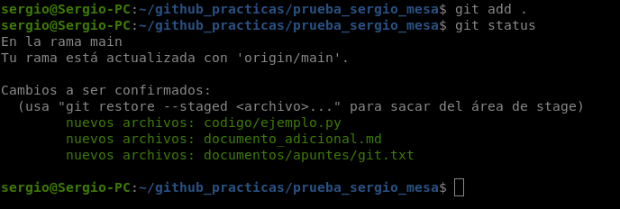

---

### 3.4. Crear un commit local

He guardado los cambios en el historial local del repositorio con un commit:

```bash
git commit -m "Añadidos archivos y estructura inicial"
```

Podemos consultar el historial de commits mediante:

```bash
git log --oneline
```

> Creación del commit y visualización del historial.  
> 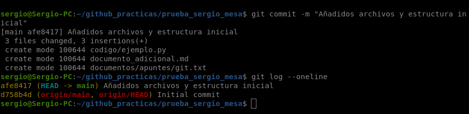

---

### 3.5. Subir los cambios a GitHub

Finalmente, he enviado el commit al repositorio remoto de GitHub:

```bash
git push origin main
```

Si la rama principal de mi repositorio se llama `master`, debo utilizar este comando en su lugar:

```bash
git push origin master
```

Tras actualizar la página de GitHub, hemos comprobado que los archivos y carpetas creados aparecen en el repositorio remoto.

> Salida de `git push`.  
> 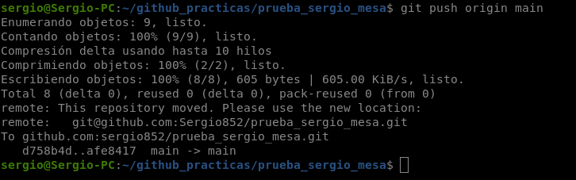

> Archivos visibles en el repositorio de GitHub.  
> 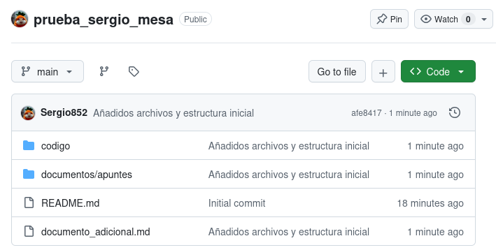

---

## 4. Segundo repositorio: práctica 1

### 4.1. Crear el repositorio remoto

Para almacenar en GitHub el repositorio local creado durante la práctica 1, he creado otro repositorio en GitHub con el nombre:

```text
practica1sergiomesa
```

He dejado sin marcar la opción de inicializar el repositorio con README, `.gitignore` o licencia, ya que mi repositorio local de la práctica 1 ya contiene archivos y posiblemente commits previos.

---

### 4.2. Asociar el repositorio local al remoto

He entrado en la carpeta donde se encuentra mi repositorio local de la práctica 1:

```bash
cd ~/sergio_mesa_mejias/
```

He comprobado el estado y los repositorios remotos configurados:

```bash
git status
git remote -v
```

Si no había ningún remoto llamado `origin`, lo he añadido con la URL SSH del repositorio recién creado:

```bash
git remote add origin git@github.com:Sergio852/practica1sergiomesa.git
```

> Configuración del remoto `origin` para la práctica 1.  
> 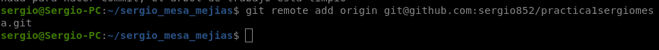

---

### 4.3. Subir la práctica 1 a GitHub

He comprobado el nombre de mi rama actual:

```bash
git branch --show-current
```

Si quiero que la rama principal se llame `main`, puedo renombrarla:

```bash
git branch -M main
```

Después, he subido el repositorio local a GitHub:

```bash
git push -u origin master
```

La opción `-u` asocia la rama local con la rama remota. De este modo, en los próximos cambios bastará normalmente con ejecutar `git push`.

>  Subida de la práctica 1 al segundo repositorio.  
> 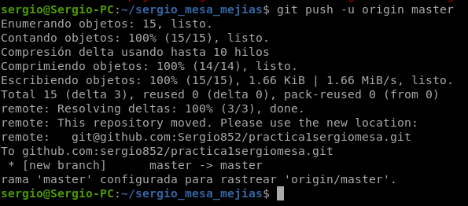

> Contenido de la práctica 1 visible en GitHub.  
> 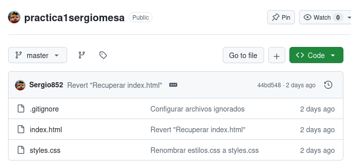

---

## 5. Lenguaje Markdown

Markdown es un lenguaje de marcado ligero utilizado para escribir documentación de forma sencilla. GitHub interpreta automáticamente los archivos con extensión `.md`, como `README.md`, y muestra el resultado con formato.

He consultado las siguientes hojas de referencia (*Cheat Sheets*):

- [Sintaxis Markdown – Markdown.es](https://markdown.es/sintaxis-markdown/)
- [Guía rápida de Markdown](https://www.markdownlang.com/es/cheatsheet/)

---

### 5.1. Modificar el archivo `README.md`

He editado el README del repositorio `prueba_sergio_mesa` con el editor de texto que prefiera. Por ejemplo, usando `nano`:

```bash
cd ~/github_practicas/prueba_sergio_mesa
nano README.md
```

He introducido el siguiente contenido. En este README hemos incluido todos los elementos solicitados en la práctica:

```markdown
# Repositorio de prueba 2ASIR – Sergio Mesa

## Introducción

En este repositorio he realizado una práctica de **GitHub** para 2ASIR.  
También podemos escribir texto en *cursiva* y palabras en `código`.

## Ejemplo de código

Este es un pequeño ejemplo de código Python:

```python
def saludar(nombre):
    return f"Hola, {nombre}!"

print(saludar("Sergio"))
```

## Pasos realizados

1. He creado un repositorio en GitHub.
2. He configurado la conexión mediante SSH.
3. He subido archivos utilizando Git.

## Contenido del repositorio

- Documentación de la práctica
- Archivos de ejemplo
- Código básico en Python

## Enlaces

- Enlace externo: [GitHub](https://github.com)
- Enlace a otro fichero Markdown: [Documento adicional](documento_adicional.md)

## Imagen


## Tabla de comandos Git

| Comando | Función |
|---|---|
| `git clone` | Clona un repositorio remoto |
| `git status` | Muestra el estado del repositorio |
| `git add .` | Añade los cambios al área de preparación |
| `git commit` | Guarda los cambios en un commit local |
| `git push` | Envía los commits al repositorio remoto |
```

> Edición del archivo `README.md` con sintaxis Markdown.  
> 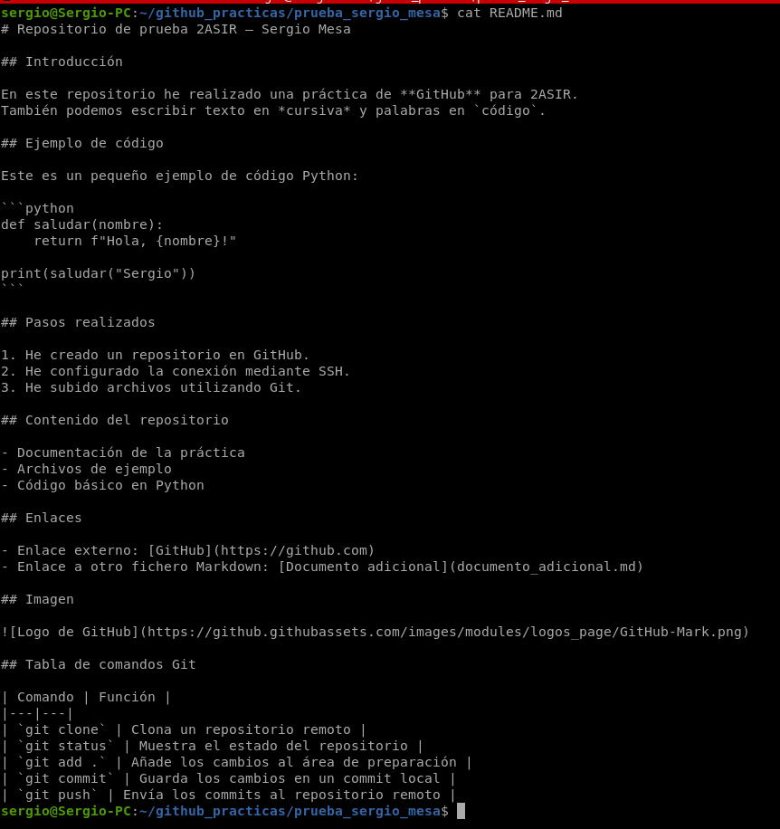

---

### 5.2. Guardar y subir el README modificado

Después de modificar el archivo, he guardado los cambios y he ejecutado los siguientes comandos:

```bash
git status
git add README.md
git commit -m "Añadido README con elementos Markdown"
git push origin main
```

Finalmente, hemos abierto el repositorio en GitHub para comprobar que el archivo `README.md` se muestra correctamente con títulos, listas, código, enlaces, imagen y tabla.

> Commit y push del README modificado.  
> 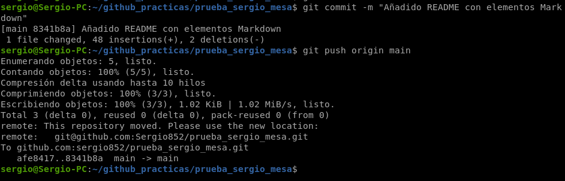

> README renderizado correctamente en GitHub.  
> 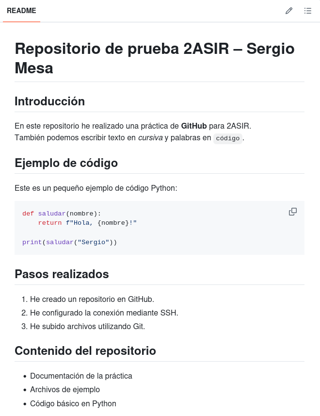

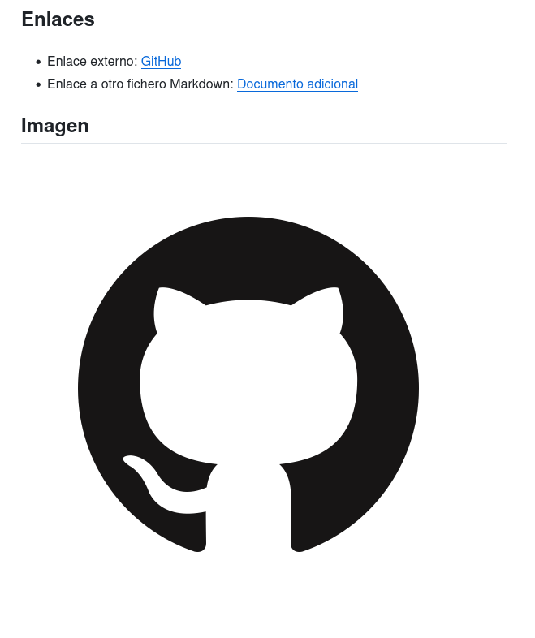

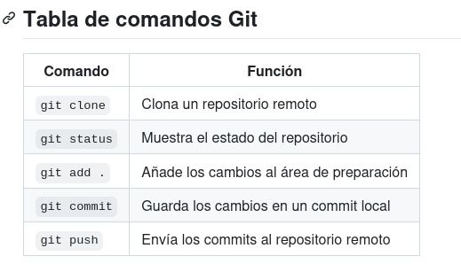