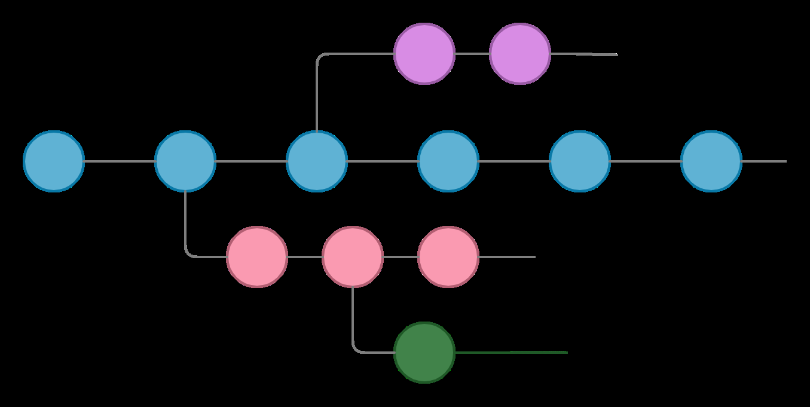

# Práctica 3: Ramas en Git

**Alumno:** Sergio Mesa Mejías  
**Módulo:** Implantación de Aplicaciones Web  
**Centro:** I.E.S. Gonzalo Nazareno  
**Fecha:** 16/09/2026

## 1. Creación de ramas

Creamos una rama local llamada `primera` y comprobamos que se ha creado correctamente:

```bash
git branch primera
git branch
```

La rama `primera` aparece junto a la rama principal.

## 2. Trabajo con la rama

Cambiamos a la rama `primera`, creamos un fichero nuevo y lo fusionamos con la rama principal:

```bash
git switch primera
git switch master
git merge primera
```

No se produce ningún conflicto porque en la rama `primera` se añade un fichero que no existía en la rama `master`. Git puede incorporarlo directamente durante la fusión.

## 3. Eliminación de la rama

Una vez fusionados los cambios, eliminamos la rama local:

```bash
git branch -d primera
```

## 4. Provocar un conflicto

Creamos una rama llamada `segunda` y modificamos el mismo fichero en las dos ramas para provocar un conflicto al fusionarlas:

```bash
git switch -c segunda
```

Modificamos `index.html` en la rama `master` y también en la rama `segunda`.

Después intentamos fusionar los cambios:

```bash
git switch master
git merge segunda
```

Git muestra un conflicto porque el mismo fichero se ha modificado de manera diferente en las dos ramas.



## 5. Resolución de conflictos

Para resolver el conflicto editamos `index.html` y eliminamos las marcas que Git ha añadido:

```text
<<<<<<< HEAD
=======
>>>>>>> segunda
```

Después dejamos únicamente la línea definitiva que queremos conservar.

Cuando el conflicto está resuelto, marcamos el fichero como solucionado y hacemos el commit:

```bash
git add index.html
git commit -m "Resuelve el conflicto de index.html"
```

Finalmente sincronizamos la rama principal con GitHub:

```bash
git push origin master
```

La práctica se realizó sobre el repositorio:

[Repositorio de la práctica](https://github.com/Sergio852/practica1sergiomesa)
