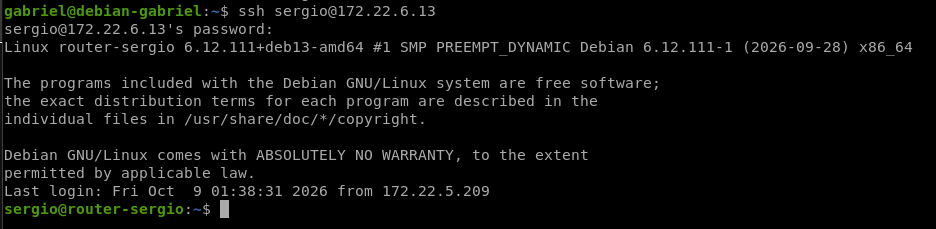

# Práctica de virtualización y redes – Sergio

## Objetivo

En esta práctica conecté mi infraestructura virtual a la red física del aula. Para ello creé un bridge en el host, definí una red puenteada en libvirt y añadí una tercera interfaz al router. Después configuré NAT para que el NAS y el servidor web, situados en la red interna `192.168.100.0/24`, pudieran acceder a Internet y resolver nombres mediante el DNS del aula.

## Topología final

La infraestructura queda formada por las siguientes redes e interfaces:

| Elemento       | Interfaz/red | Dirección o función                                 |
| -------------- | ------------ | --------------------------------------------------- |
| Host Sergio-PC | `br0`        | Bridge conectado a la red del aula, `172.22.6.6/16` |
| Router         | `enp1s0`     | Red de gestión `192.168.122.0/24`                   |
| Router         | `enp2s0`     | Red interna `192.168.100.0/24`, IP `192.168.100.10` |
| Router         | `enp8s0`     | Red del aula, IP obtenida por DHCP `172.22.6.13/16` |
| NAS            | Red interna  | `192.168.100.20`                                    |
| Servidor web   | Red interna  | `192.168.100.30`                                    |

El bridge permite que la interfaz virtual del router conectada a `red_publica_aula` se comporte como un equipo más de la red física del aula. La red interna sigue separada y el router es quien reenvía y traduce el tráfico hacia el exterior.

## 1. Estado inicial del host

Antes de cambiar la configuración, comprobé las interfaces, direcciones IP, rutas y el gestor de red activo. La interfaz física conectada al aula era `enx6c6e0750c3be`; NetworkManager estaba activo y `systemd-networkd` inactivo.

```text
sergio@Sergio-PC:~$ ip -br link
lo               UNKNOWN        00:00:00:00:00:00 <LOOPBACK,UP,LOWER_UP> 
enx6c6e0750c3be  UP             6c:6e:07:50:c3:be <BROADCAST,MULTICAST,UP,LOWER_UP> 
wlp1s0           DOWN           b6:c5:43:ce:af:91 <NO-CARRIER,BROADCAST,MULTICAST,UP> 
virbr1           DOWN           52:54:00:95:09:79 <NO-CARRIER,BROADCAST,MULTICAST,UP> 
virbr3           DOWN           52:54:00:2f:f9:26 <NO-CARRIER,BROADCAST,MULTICAST,UP> 
virbr10          UP             52:54:00:fd:1f:c8 <BROADCAST,MULTICAST,UP,LOWER_UP> 
virbr0           UP             52:54:00:cd:cf:48 <BROADCAST,MULTICAST,UP,LOWER_UP> 
virbr2           DOWN           52:54:00:81:92:03 <NO-CARRIER,BROADCAST,MULTICAST,UP> 
vnet0            UNKNOWN        fe:54:00:73:d1:bd <BROADCAST,MULTICAST,UP,LOWER_UP> 
vnet1            UNKNOWN        fe:54:00:22:c8:a1 <BROADCAST,MULTICAST,UP,LOWER_UP> 
vnet2            UNKNOWN        fe:54:00:c7:0b:5e <BROADCAST,MULTICAST,UP,LOWER_UP> 
vnet3            UNKNOWN        fe:54:00:48:4e:da <BROADCAST,MULTICAST,UP,LOWER_UP> 
sergio@Sergio-PC:~$ ip -br addr
lo               UNKNOWN        127.0.0.1/8 ::1/128 
enx6c6e0750c3be  UP             172.22.3.211/16 fe80::f69f:9787:786e:e4f6/64 
wlp1s0           DOWN           
virbr1           DOWN           192.168.105.1/24 
virbr3           DOWN           
virbr10          UP             192.168.100.1/24 
virbr0           UP             192.168.122.1/24 
virbr2           DOWN           10.10.10.1/24 
vnet0            UNKNOWN        fe80::fc54:ff:fe73:d1bd/64 
vnet1            UNKNOWN        fe80::fc54:ff:fe22:c8a1/64 
vnet2            UNKNOWN        fe80::fc54:ff:fec7:b5e/64 
vnet3            UNKNOWN        fe80::fc54:ff:fe48:4eda/64 
sergio@Sergio-PC:~$ ip route
default via 172.22.0.1 dev enx6c6e0750c3be proto dhcp src 172.22.3.211 metric 100 
10.10.10.0/24 dev virbr2 proto kernel scope link src 10.10.10.1 linkdown 
172.22.0.0/16 dev enx6c6e0750c3be proto kernel scope link src 172.22.3.211 metric 100 
192.168.100.0/24 dev virbr10 proto kernel scope link src 192.168.100.1 
192.168.105.0/24 dev virbr1 proto kernel scope link src 192.168.105.1 linkdown 
192.168.122.0/24 dev virbr0 proto kernel scope link src 192.168.122.1 
sergio@Sergio-PC:~$ nmcli device status
DEVICE           TYPE      STATE                   CONNECTION          
enx6c6e0750c3be  ethernet  conectado               Conexión cableada 1 
lo               loopback  connected (externally)  lo                  
virbr0           bridge    connected (externally)  virbr0              
virbr1           bridge    connected (externally)  virbr1              
virbr10          bridge    connected (externally)  virbr10             
virbr2           bridge    connected (externally)  virbr2              
vnet0            tun       connected (externally)  vnet0               
vnet1            tun       connected (externally)  vnet1               
vnet2            tun       connected (externally)  vnet2               
vnet3            tun       connected (externally)  vnet3               
wlp1s0           wifi      desconectado            --                  
p2p-dev-wlp1s0   wifi-p2p  desconectado            --                  
virbr3           bridge    sin gestión             --                  
sergio@Sergio-PC:~$ systemctl is-active NetworkManager
systemctl is-active systemd-networkd
active
inactive
sergio@Sergio-PC:~$ command -v nmcli
command -v bridge
command -v brctl
/usr/bin/nmcli
sergio@Sergio-PC:~$ 
```

## 2. Bridge en el host

Creé el bridge `br0` con NetworkManager. El bridge recibe la configuración IP por DHCP y la interfaz física `enx6c6e0750c3be` pasa a ser un puerto del bridge. De esta forma, la IP ya no queda configurada directamente sobre la NIC física, sino sobre `br0`.

```text
sergio@Sergio-PC:~$ sudo nmcli connection add \
  type bridge \
  ifname br0 \
  con-name br0 \
  ipv4.method auto \
  ipv6.method auto \
  bridge.stp no
Conexión «br0» (44a781bc-6a64-4b74-8741-16b6b06dd12a) añadida con éxito.
sergio@Sergio-PC:~$ sudo nmcli connection add \
  type ethernet \
  ifname enx6c6e0750c3be \
  con-name br0-enx6c6e0750c3be \
  master br0 \
  slave-type bridge
Conexión «br0-enx6c6e0750c3be» (8987a0d7-7142-44cc-b244-dd9dcc1fb23c) añadida con éxito.
sergio@Sergio-PC:~$ sudo nmcli connection modify br0 connection.autoconnect yes connection.autoconnect-slaves 1
sergio@Sergio-PC:~$ sudo nmcli connection down "Conexión cableada 1"
La conexión «Conexión cableada 1» se desactivó correctamente (ruta activa D-Bus: /org/freedesktop/NetworkManager/ActiveConnection/2)
sergio@Sergio-PC:~$ sudo nmcli connection up br0
La conexión se ha activado correctamente (controller waiting for ports) (ruta activa D-Bus: /org/freedesktop/NetworkManager/ActiveConnection/13)
sergio@Sergio-PC:~$ ip -br addr show br0
ip route
nmcli device status
br0              UP             172.22.6.6/16 fe80::a78b:70c2:8df2:d302/64 
default via 172.22.0.1 dev br0 proto dhcp src 172.22.6.6 metric 425 
10.10.10.0/24 dev virbr2 proto kernel scope link src 10.10.10.1 linkdown 
172.22.0.0/16 dev br0 proto kernel scope link src 172.22.6.6 metric 425 
192.168.100.0/24 dev virbr10 proto kernel scope link src 192.168.100.1 
192.168.105.0/24 dev virbr1 proto kernel scope link src 192.168.105.1 linkdown 
192.168.122.0/24 dev virbr0 proto kernel scope link src 192.168.122.1 
DEVICE           TYPE      STATE                   CONNECTION          
br0              bridge    conectado               br0                 
enx6c6e0750c3be  ethernet  conectado               br0-enx6c6e0750c3be 
lo               loopback  connected (externally)  lo                  
virbr0           bridge    connected (externally)  virbr0              
virbr1           bridge    connected (externally)  virbr1              
virbr10          bridge    connected (externally)  virbr10             
virbr2           bridge    connected (externally)  virbr2              
vnet0            tun       connected (externally)  vnet0               
vnet1            tun       connected (externally)  vnet1               
vnet2            tun       connected (externally)  vnet2               
vnet3            tun       connected (externally)  vnet3               
wlp1s0           wifi      desconectado            --                  
p2p-dev-wlp1s0   wifi-p2p  desconectado            --                  
virbr3           bridge    sin gestión             --                  
sergio@Sergio-PC:~$ 
```

La salida confirma que `br0` está activo, posee la dirección `172.22.6.6/16` y tiene como ruta por defecto el gateway `172.22.0.1`. También confirma que la interfaz física está asociada a la conexión `br0-enx6c6e0750c3be`.

## 3. Conectividad del host

Verifiqué que el cambio a un bridge no interrumpió la conexión del host con la red del aula, Internet ni el DNS.

```text
sergio@Sergio-PC:~$ ping -c 3 172.22.0.1
PING 172.22.0.1 (172.22.0.1) 56(84) bytes of data.
64 bytes from 172.22.0.1: icmp_seq=1 ttl=64 time=1.44 ms
64 bytes from 172.22.0.1: icmp_seq=2 ttl=64 time=1.54 ms
64 bytes from 172.22.0.1: icmp_seq=3 ttl=64 time=1.60 ms

--- 172.22.0.1 ping statistics ---
3 packets transmitted, 3 received, 0% packet loss, time 2003ms
rtt min/avg/max/mdev = 1.441/1.527/1.600/0.065 ms
sergio@Sergio-PC:~$ ^C
sergio@Sergio-PC:~$ ping -c 3 1.1.1.1
PING 1.1.1.1 (1.1.1.1) 56(84) bytes of data.
64 bytes from 1.1.1.1: icmp_seq=1 ttl=54 time=7.51 ms
64 bytes from 1.1.1.1: icmp_seq=2 ttl=54 time=7.74 ms
64 bytes from 1.1.1.1: icmp_seq=3 ttl=54 time=7.86 ms

--- 1.1.1.1 ping statistics ---
3 packets transmitted, 3 received, 0% packet loss, time 2004ms
rtt min/avg/max/mdev = 7.514/7.705/7.862/0.144 ms
sergio@Sergio-PC:~$ ^C
sergio@Sergio-PC:~$ getent hosts deb.debian.org
2a04:4e42:1f::644 debian.map.fastlydns.net deb.debian.org
sergio@Sergio-PC:~$ 
```

## 4. Red puenteada de libvirt

Definí `red_publica_aula` como una red de libvirt en modo bridge. Esta red no aplica NAT de libvirt: conecta directamente las interfaces de las máquinas virtuales al bridge `br0` del host.

```text
sergio@Sergio-PC:~$ cat /tmp/red-publica-aula.xml 
<network>
  <name>red_publica_aula</name>
  <forward mode='bridge'/>
  <bridge name='br0'/>
</network>
sergio@Sergio-PC:~$ sudo virsh net-define /tmp/red-publica-aula.xml
La red red_publica_aula se encuentra definida desde /tmp/red-publica-aula.xml

sergio@Sergio-PC:~$ sudo virsh net-start red_publica_aula
La red red_publica_aula se ha iniciado

sergio@Sergio-PC:~$ sudo virsh net-autostart red_publica_aula
La red red_publica_aula ha sido marcada para iniciarse automáticamente

sergio@Sergio-PC:~$ sudo virsh net-list --all
 Nombre             Estado   Inicio automático   Persistente
--------------------------------------------------------------
 br-nat             activo   si                  si
 br-red1            activo   si                  si
 br-red2            activo   si                  si
 default            activo   si                  si
 red_intra          activo   si                  si
 red_publica_aula   activo   si                  si

sergio@Sergio-PC:~$ sudo virsh net-dumpxml red_publica_aula
<network>
  <name>red_publica_aula</name>
  <uuid>12d9e2d3-c531-45c8-9333-261d7ab8490f</uuid>
  <forward mode='bridge'/>
  <bridge name='br0'/>
</network>

sergio@Sergio-PC:~$ ip -br addr show br0
br0              UP             172.22.6.6/16 fe80::a78b:70c2:8df2:d302/64 
sergio@Sergio-PC:~$ ip route
default via 172.22.0.1 dev br0 proto dhcp src 172.22.6.6 metric 425 
10.10.10.0/24 dev virbr2 proto kernel scope link src 10.10.10.1 linkdown 
172.22.0.0/16 dev br0 proto kernel scope link src 172.22.6.6 metric 425 
192.168.100.0/24 dev virbr10 proto kernel scope link src 192.168.100.1 
192.168.105.0/24 dev virbr1 proto kernel scope link src 192.168.105.1 linkdown 
192.168.122.0/24 dev virbr0 proto kernel scope link src 192.168.122.1 
sergio@Sergio-PC:~$ nmcli device status
DEVICE           TYPE      STATE                   CONNECTION          
br0              bridge    conectado               br0                 
enx6c6e0750c3be  ethernet  conectado               br0-enx6c6e0750c3be 
lo               loopback  connected (externally)  lo                  
virbr0           bridge    connected (externally)  virbr0              
virbr1           bridge    connected (externally)  virbr1              
virbr10          bridge    connected (externally)  virbr10             
virbr2           bridge    connected (externally)  virbr2              
vnet0            tun       connected (externally)  vnet0               
vnet1            tun       connected (externally)  vnet1               
vnet2            tun       connected (externally)  vnet2               
vnet3            tun       connected (externally)  vnet3               
wlp1s0           wifi      desconectado            --                  
p2p-dev-wlp1s0   wifi-p2p  desconectado            --                  
virbr3           bridge    sin gestión             --                  
sergio@Sergio-PC:~$ 
```

## 5. Interfaz pública del router

Con el router en ejecución, añadí una nueva interfaz virtual de modelo `virtio` conectada a `red_publica_aula`. Usé `--live` para que estuviera disponible inmediatamente y `--config` para conservarla en la configuración persistente de la máquina virtual.

```text
sergio@Sergio-PC:~$ sudo virsh list --all
 Id   Nombre               Estado
---------------------------------------
 1    router-sergio        ejecutando
 2    servidorNAS-sergio   ejecutando
 3    servidorWeb-sergio   ejecutando
 -    ansible-bd           apagado
 -    ansible-web          apagado
 -    app-web              apagado
 -    debian13             apagado
 -    oracle               apagado
 -    servidor-seg         apagado
 -    windows-seguridad    apagado

sergio@Sergio-PC:~$ sudo virsh attach-interface \
  --domain router-sergio \
  --type network \
  --source red_publica_aula \
  --model virtio \
  --live \
  --config
La interfaz ha sido asociada exitosamente

sergio@Sergio-PC:~$ sudo virsh domiflist router-sergio
 Interfaz   Tipo      Fuente             Modelo   MAC
---------------------------------------------------------------------
 vnet0      network   default            virtio   52:54:00:73:d1:bd
 vnet1      network   red_intra          virtio   52:54:00:22:c8:a1
 vnet4      bridge    red_publica_aula   virtio   52:54:00:79:7e:63

sergio@Sergio-PC:~$ ssh router
Linux router-sergio 6.12.111+deb13-amd64 #1 SMP PREEMPT_DYNAMIC Debian 6.12.111-1 (2026-09-28) x86_64

The programs included with the Debian GNU/Linux system are free software;
the exact distribution terms for each program are described in the
individual files in /usr/share/doc/*/copyright.

Debian GNU/Linux comes with ABSOLUTELY NO WARRANTY, to the extent
permitted by applicable law.
Last login: Thu Oct  8 10:41:24 2026 from 192.168.122.1
sergio@router-sergio:~$ 
sergio@router-sergio:~$ ip -br link
lo               UNKNOWN        00:00:00:00:00:00 <LOOPBACK,UP,LOWER_UP> 
enp1s0           UP             52:54:00:73:d1:bd <BROADCAST,MULTICAST,UP,LOWER_UP> 
enp2s0           UP             52:54:00:22:c8:a1 <BROADCAST,MULTICAST,UP,LOWER_UP> 
enp8s0           DOWN           52:54:00:79:7e:63 <BROADCAST,MULTICAST> 
sergio@router-sergio:~$ ip -br addr
lo               UNKNOWN        127.0.0.1/8 ::1/128 
enp1s0           UP             192.168.122.221/24 fe80::5054:ff:fe73:d1bd/64 
enp2s0           UP             192.168.100.10/24 fe80::5054:ff:fe22:c8a1/64 
enp8s0           DOWN           
sergio@router-sergio:~$ 
```

En el router, la nueva NIC se detectó como `enp8s0`, inicialmente sin dirección IP y en estado `DOWN`.

## 6. DHCP en la interfaz enp8s0

Configuré `enp8s0` mediante DHCP en `/etc/network/interfaces`. La interfaz `enp1s0` se mantiene en la red de gestión, mientras que `enp2s0` conserva la IP estática de la red interna.

```text
sergio@router-sergio:~$ sudo cp /etc/network/interfaces /etc/network/interfaces.bak-publica
sergio@router-sergio:~$ sudo nano /etc/network/interfaces
sergio@router-sergio:~$ sudo cat /etc/network/interfaces
# This file describes the network interfaces available on your system
# and how to activate them. For more information, see interfaces(5).

source /etc/network/interfaces.d/*

# The loopback network interface
auto lo
iface lo inet loopback

# The primary network interface
allow-hotplug enp1s0
iface enp1s0 inet dhcp

# Internal isolated network
auto enp2s0
iface enp2s0 inet static
    address 192.168.100.10
    netmask 255.255.255.0

auto enp8s0
iface enp8s0 inet dhcp
sergio@router-sergio:~$ sudo ifup enp8s0
Internet Systems Consortium DHCP Client 4.4.3-P1
Copyright 2004-2022 Internet Systems Consortium.
All rights reserved.
For info, please visit [https://www.isc.org/software/dhcp/](https://www.isc.org/software/dhcp/)

can't create /var/lib/dhcp/dhclient.enp8s0.leases: No such file or directory
Listening on LPF/enp8s0/52:54:00:79:7e:63
Sending on   LPF/enp8s0/52:54:00:79:7e:63
Sending on   Socket/fallback
Created duid "\000\001\000\0012[G\375RT\000y~c".
can't create /var/lib/dhcp/dhclient.enp8s0.leases: No such file or directory
DHCPDISCOVER on enp8s0 to 255.255.255.255 port 67 interval 8
DHCPOFFER of 172.22.6.13 from 172.22.0.1
DHCPREQUEST for 172.22.6.13 on enp8s0 to 255.255.255.255 port 67
DHCPACK of 172.22.6.13 from 172.22.0.1
can't create /var/lib/dhcp/dhclient.enp8s0.leases: No such file or directory
bound to 172.22.6.13 -- renewal in 34332 seconds.
sergio@router-sergio:~$ ip -br addr show enp8s0
enp8s0           UP             172.22.6.13/16 fe80::5054:ff:fe79:7e63/64 
sergio@router-sergio:~$ ip route
default via 192.168.122.1 dev enp1s0 
172.22.0.0/16 dev enp8s0 proto kernel scope link src 172.22.6.13 
192.168.100.0/24 dev enp2s0 proto kernel scope link src 192.168.100.10 
192.168.122.0/24 dev enp1s0 proto kernel scope link src 192.168.122.221 
sergio@router-sergio:~$ ping -c 3 172.22.0.1
PING 172.22.0.1 (172.22.0.1) 56(84) bytes of data.
64 bytes from 172.22.0.1: icmp_seq=1 ttl=64 time=2.95 ms
64 bytes from 172.22.0.1: icmp_seq=2 ttl=64 time=1.61 ms
64 bytes from 172.22.0.1: icmp_seq=3 ttl=64 time=1.91 ms

--- 172.22.0.1 ping statistics ---
3 packets transmitted, 3 received, 0% packet loss, time 2003ms
rtt min/avg/max/mdev = 1.607/2.157/2.951/0.575 ms
```

El servidor DHCP del aula, `172.22.0.1`, asignó la dirección `172.22.6.13/16` a `enp8s0`. La ruta conectada a `172.22.0.0/16` confirma que el router ya alcanza directamente la red del aula. Los avisos sobre el fichero de leases no impidieron que el proceso DHCP se completara correctamente.

## 7. NAT y salida desde la red interna

La red `192.168.100.0/24` es privada y la red del aula no tiene por qué conocer una ruta de retorno hacia ella. Por eso añadí una regla `MASQUERADE` en `POSTROUTING`: las conexiones iniciadas desde el NAS o el servidor web y enviadas por `enp8s0` pasan a utilizar como origen la dirección `172.22.6.13` del router.

```text
sergio@router-sergio:~$ sudo iptables -t nat -A POSTROUTING -s 192.168.100.0/24 -o enp8s0 -j MASQUERADE
sergio@router-sergio:~$ 
```

Con esta traducción de direcciones, las respuestas externas regresan al router y este puede devolverlas al equipo interno que inició la comunicación. El reenvío IPv4 del router ya estaba habilitado, condición necesaria para que pueda reenviar tráfico entre interfaces.

## 8. Pruebas de conectividad de los servidores

Probé la conectividad IP desde los dos servidores de la red interna. Ambos alcanzan `1.1.1.1`, por lo que el tráfico sale correctamente a través del router.

```text
sergio@Sergio-PC:~$ ssh user@192.168.100.30 "ping -c 3 1.1.1.1"
PING 1.1.1.1 (1.1.1.1) 56(84) bytes of data.
64 bytes from 1.1.1.1: icmp_seq=1 ttl=52 time=8.50 ms
64 bytes from 1.1.1.1: icmp_seq=2 ttl=52 time=10.4 ms
64 bytes from 1.1.1.1: icmp_seq=3 ttl=52 time=8.57 ms

--- 1.1.1.1 ping statistics ---
3 packets transmitted, 3 received, 0% packet loss, time 2003ms
rtt min/avg/max/mdev = 8.499/9.142/10.362/0.862 ms
sergio@Sergio-PC:~$ ssh root@192.168.100.20 "ping -c 3 1.1.1.1"
PING 1.1.1.1 (1.1.1.1): 56 data bytes
64 bytes from 1.1.1.1: seq=0 ttl=52 time=8.767 ms
64 bytes from 1.1.1.1: seq=1 ttl=52 time=8.584 ms
64 bytes from 1.1.1.1: seq=2 ttl=52 time=8.528 ms

--- 1.1.1.1 ping statistics ---
3 packets transmitted, 3 packets received, 0% packet loss
round-trip min/avg/max = 8.528/8.626/8.767 ms
```

## 9. Resolución DNS

También verifiqué que los dos servidores pueden resolver nombres a través del DNS del aula, `172.22.0.1`. La resolución DNS complementa la prueba de conectividad IP: no basta con poder alcanzar una dirección IP si los servidores no son capaces de traducir nombres de dominio.

```text
sergio@Sergio-PC:~$ ssh root@192.168.100.20 "getent hosts deb.debian.org"
2a04:4e42:1f::644  debian.map.fastlydns.net  debian.map.fastlydns.net deb.debian.org
sergio@Sergio-PC:~$ ssh user@192.168.100.30 "nslookup deb.debian.org 172.22.0.1"
Server:172.22.0.1
Address:172.22.0.1#53

Non-authoritative answer:
deb.debian.orgcanonical name = debian.map.fastlydns.net.
Name:debian.map.fastlydns.net
Address: 151.101.134.132
Name:debian.map.fastlydns.net
Address: 2a04:4e42:1f::644

sergio@Sergio-PC:~$ 
```

El NAS resuelve `deb.debian.org` mediante `getent`, y el servidor web obtiene respuestas IPv4 e IPv6 del DNS del aula mediante `nslookup`.

## 10. Verificación por un compañero

Un compañero se conectó por SSH a mi entorno para comprobar la accesibilidad desde otro equipo.

<!-- INSERTAR AQUÍ LA CAPTURA gabirielssh.png -->



## Resultado

He conseguido integrar la infraestructura virtual con la red del aula sin perder la conectividad del host. El router dispone ahora de tres interfaces: gestión, red interna y red pública del aula. El NAS y el servidor web de la red `192.168.100.0/24` pueden salir a Internet y resolver nombres a través del router, gracias al reenvío IP y a la regla de NAT aplicada sobre `enp8s0`.
