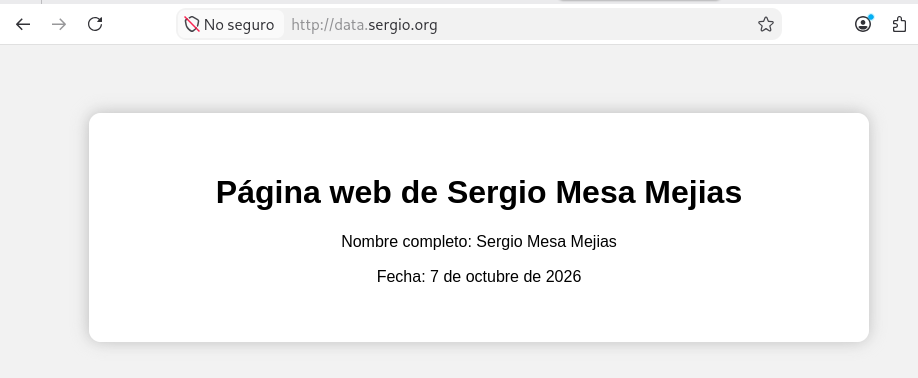

# Memoria de práctica – Infraestructura virtual y servicios (QEMU/KVM + libvirt)

## 0. Objetivo de la práctica

El objetivo de esta práctica es montar una infraestructura virtual completa con QEMU/KVM y libvirt, compuesta por:

- Un **router** que interconecta varias redes y proporciona acceso a Internet.
- Un **servidor NAS** que ofrece almacenamiento compartido mediante NFS.
- Un **servidor web** que sirve una página estática almacenada en el NAS.

Además, se configuran:

- Redes privadas y una red de gestión.
- NAT/SNAT para que las máquinas internas salgan a Internet.
- DNAT para exponer el servicio web desde el exterior.
- Snapshots para guardar un estado funcional de la infraestructura.

A continuación documento tanto las **comprobaciones finales** (entregables) como los **pasos y razonamientos** que me han llevado a tener esa infraestructura funcionando.

---

## I. Comprobaciones finales de la infraestructura virtual

### 1. Redes configuradas en libvirt

Compruebo las redes gestionadas por libvirt y verifico que la red `default` y la red aislada `red_intra` están activas y configuradas para iniciarse automáticamente:

```bash
sergio@Sergio-PC:~$ sudo virsh net-list --all
Nombre             Estado   Inicio automático   Persistente
br-nat             activo   si                  si
br-red1            activo   si                  si
br-red2            activo   si                  si
default            activo   si                  si
red_intra          activo   si                  si
```

Esto confirma que:

- `default`: red NAT usada habitualmente para la interfaz “exterior” del router.
- `red_intra`: red interna aislada donde están el NAS y el servidor web (192.168.100.0/24).
- Ambas están marcadas como **autostart**, por lo que se levantan automáticamente con el host.

---

### 2. Máquinas virtuales con autoinicio

Compruebo que las tres máquinas virtuales principales están configuradas para iniciarse automáticamente con el host:

```bash
sergio@Sergio-PC:~$ sudo virsh list --all --autostart
 Id   Nombre               Estado
 1    router-sergio        ejecutando
 4    servidorNAS-sergio   ejecutando
 6    servidorWeb-sergio   ejecutando
```

Esto garantiza que, al reiniciar el host, el router, el NAS y el servidor web se levanten solos y la infraestructura quede operativa sin intervención manual.

---

### 3. Acceso SSH al router

Compruebo el acceso al router mediante SSH utilizando el usuario `sergio`, sin introducir contraseña (gracias a las claves SSH configuradas previamente), y verifico el hostname:

```bash
sergio@Sergio-PC:~$ ssh sergio@router "hostname && whoami"
router-sergio
sergio
```

Esto confirma que:

- El nombre de la máquina es `router-sergio`.
- El usuario remoto es `sergio`.
- El acceso por clave SSH está correctamente configurado.

---

### 4. Comprobación de sudo en el router

Compruebo que el usuario `sergio` puede ejecutar comandos con privilegios de root sin que se solicite contraseña:

```bash
sergio@Sergio-PC:~$ ssh sergio@router "sudo -n whoami"
root
```

La opción `-n` fuerza que `sudo` no pida contraseña; si funcionara, significa que el usuario está en el grupo `sudo` y tiene configurada la regla correspondiente en `/etc/sudoers` (o en un fichero dentro de `/etc/sudoers.d/`).

---

### 5. Acceso SSH al servidor NAS

Compruebo el acceso al servidor NAS mediante SSH utilizando el usuario `user`, sin introducir contraseña, y verifico el hostname:

```bash
sergio@Sergio-PC:~$ ssh user@nas "hostname && whoami"
nas-sergio
user
```

Esto confirma que:

- El hostname del NAS es `nas-sergio`.
- El usuario remoto es `user`.
- El acceso por clave SSH está correctamente configurado también para el NAS.

---

### 6. Disco adicional del servidor NAS

Compruebo que el disco adicional está montado en `/srv/data`:

```bash
sergio@Sergio-PC:~$ ssh root@nas "df -h /srv/data"
Filesystem      Size  Used Available Use% Mounted on
/dev/sdb1       987.4M  276.0K  920.1M   0% /srv/data
```

Y verifico que el montaje del disco está configurado de forma persistente mediante `/etc/fstab`:

```bash
sergio@Sergio-PC:~$ ssh root@nas "grep '/srv/data' /etc/fstab"
UUID=bcef8ed8-c86c-43f3-910f-5d9a3d8779c2 /srv/data ext4 defaults 0 2
```

Esto asegura que, tras un reinicio del NAS, el disco adicional se monte automáticamente en `/srv/data`.

> **Cómo llegué a esto:**  
> Añadí un segundo disco virtual al NAS desde libvirt, lo particioné (`fdisk` o `parted`), creé un sistema de ficheros `ext4` y lo monté en `/srv/data`. Luego añadí la línea correspondiente en `/etc/fstab` usando el UUID de la partición para que el montaje sea robusto ante cambios de nombre de dispositivo.

---

### 7. Acceso SSH al servidor web

Compruebo el acceso al servidor web mediante SSH utilizando el usuario `user`, sin introducir contraseña, y verifico el hostname:

```bash
sergio@Sergio-PC:~$ ssh -i ~/.ssh/id_rsa user@web "hostname && whoami"
web-sergio
user
```

Aquí uso explícitamente `-i ~/.ssh/id_rsa` porque la clave privada para este servidor está en ese fichero (puede ser una clave distinta a la del router/NAS).

---

### 8. Comprobación de Internet desde el router

Compruebo que el router tiene acceso a Internet:

```bash
sergio@Sergio-PC:~$ ssh sergio@router "ping -c 3 1.1.1.1"
PING 1.1.1.1 (1.1.1.1) 56(84) bytes of data.
64 bytes from 1.1.1.1: icmp_seq=1 ttl=54 time=16.0 ms
64 bytes from 1.1.1.1: icmp_seq=2 ttl=54 time=11.7 ms
64 bytes from 1.1.1.1: icmp_seq=3 ttl=54 time=16.2 ms
--- 1.1.1.1 ping statistics ---
3 packets transmitted, 3 received, 0% packet loss, time 2003ms
rtt min/avg/max/mdev = 11.744/14.654/16.190/2.058 ms
```

Esto confirma que la interfaz “exterior” del router está correctamente conectada a una red con salida a Internet (típicamente la red `default` de libvirt o una red puenteada al aula).

---

### 9. Comprobación de Internet desde el servidor NAS

Compruebo que el NAS tiene acceso a Internet a través del router mediante SNAT:

```bash
sergio@Sergio-PC:~$ ssh user@nas "ping -c 3 1.1.1.1"
PING 1.1.1.1 (1.1.1.1): 56 data bytes
64 bytes from 1.1.1.1: seq=0 ttl=42 time=18.038 ms
64 bytes from 1.1.1.1: seq=1 ttl=42 time=16.888 ms
64 bytes from 1.1.1.1: seq=2 ttl=42 time=13.548 ms
--- 1.1.1.1 ping statistics ---
3 packets transmitted, 3 packets received, 0% packet loss
round-trip min/avg/max = 13.548/16.158/18.038 ms
```

El TTL más bajo (42 frente a 54 del router) indica que el paquete pasa por al menos un NAT (el router).

---

### 10. Comprobación de Internet desde el servidor web

Compruebo que el servidor web tiene acceso a Internet a través del router mediante SNAT:

```bash
sergio@Sergio-PC:~$ ssh -i ~/.ssh/id_rsa user@web "ping -c 3 1.1.1.1"
PING 1.1.1.1 (1.1.1.1) 56(84) bytes of data.
64 bytes from 1.1.1.1: icmp_seq=1 ttl=53 time=12.7 ms
64 bytes from 1.1.1.1: icmp_seq=2 ttl=53 time=19.1 ms
64 bytes from 1.1.1.1: icmp_seq=3 ttl=53 time=12.8 ms
--- 1.1.1.1 ping statistics ---
3 packets transmitted, 3 received, 0% packet loss, time 2004ms
rtt min/avg/max/mdev = 12.738/14.869/19.111/2.999 ms
```

De nuevo, el TTL reducido confirma que el tráfico pasa por el router con NAT.

---

### 11. Comprobación del forwarding IPv4

Compruebo que el reenvío de paquetes IPv4 está activado en el router:

```bash
sergio@Sergio-PC:~$ ssh sergio@router "sudo sysctl net.ipv4.ip_forward"
net.ipv4.ip_forward = 1
```

Esto es necesario para que el router pueda actuar como tal: recibir paquetes de una interfaz y enviarlos por otra.

> **Cómo llegué a esto:**  
> En el router, habilité el forwarding IP de forma permanente (por ejemplo, editando `/etc/sysctl.conf` o creando un fichero en `/etc/sysctl.d/` con `net.ipv4.ip_forward=1`) y recargué la configuración con `sysctl --system`.

---

### 12. Comprobación de la regla SNAT

Compruebo que el router tiene configurada la regla de masquerade para traducir las conexiones de la red interna hacia la interfaz exterior:

```bash
sergio@Sergio-PC:~$ ssh sergio@router "sudo iptables -t nat -L POSTROUTING -n -v"
Chain POSTROUTING (policy ACCEPT 0 packets, 0 bytes)
pkts bytes target     prot opt in     out     source               destination         
713  59915 MASQUERADE  all  --  *      enp1s0  0.0.0.0/0            0.0.0.0/0           
```

Esto indica que todo el tráfico que sale por `enp1s0` (interfaz “exterior”) se enmascara con la IP de esa interfaz (SNAT/MASQUERADE).

> **Cómo llegué a esto:**  
> En el router ejecuté algo similar a:
> 
> ```bash
> sudo iptables -t nat -A POSTROUTING -s 192.168.100.0/24 -o enp1s0 -j MASQUERADE
> ```
> 
> y luego guardé las reglas para que sean persistentes (ver sección 14).

---

### 13. Comprobación de las reglas de forwarding

Compruebo las reglas que permiten el tráfico desde la red interna hacia Internet y las respuestas desde Internet hacia la red interna:

```bash
sergio@Sergio-PC:~$ ssh sergio@router "sudo iptables -L FORWARD -n -v"
Chain FORWARD (policy ACCEPT 0 packets, 0 bytes)
pkts bytes target     prot opt in     out     source               destination         
3743 283K  ACCEPT     all  --  enp2s0 enp1s0  0.0.0.0/0            0.0.0.0/0           
4778 66M   ACCEPT     all  --  enp1s0 enp2s0  0.0.0.0/0            0.0.0.0/0            ctstate RELATED,ESTABLISHED
```

Interpretación:

- Tráfico de `enp2s0` (red interna) hacia `enp1s0` (exterior): permitido.
- Tráfico de `enp1s0` hacia `enp2s0` solo si está relacionado con conexiones ya establecidas (`RELATED,ESTABLISHED`): típico de un router NAT.

> **Cómo llegué a esto:**  
> En el router añadí reglas del tipo:
> 
> ```bash
> sudo iptables -A FORWARD -i enp2s0 -o enp1s0 -j ACCEPT
> sudo iptables -A FORWARD -i enp1s0 -o enp2s0 -m conntrack --ctstate RELATED,ESTABLISHED -j ACCEPT
> ```

---

### 14. Comprobación de la persistencia del SNAT

Compruebo que el servicio encargado de restaurar las reglas de iptables está habilitado:

```bash
sergio@Sergio-PC:~$ ssh sergio@router "sudo systemctl is-enabled netfilter-persistent"
enabled
```

Esto asegura que, tras reiniciar el router, las reglas de NAT y FORWARD se restauran automáticamente.

> **Cómo llegué a esto:**  
> En Debian/derivados, instalé `iptables-persistent` y guardé las reglas actuales (por ejemplo, con `netfilter-persistent save` o mediante el mecanismo que use la distribución), de modo que se carguen en el arranque.

---

### 15. Ventaja de la clonación enlazada

La gran ventaja de la **clonación enlazada** es que permite crear una máquina virtual a partir de una imagen base sin copiar todo su contenido. La máquina clonada utiliza la imagen original como disco base y almacena únicamente los cambios realizados en un disco diferencial.

De esta forma:

- La creación de la máquina virtual es mucho más rápida.
- Ocupa menos espacio en disco que una copia completa o una instalación desde cero.

Como inconveniente, la máquina clonada depende de la imagen base, por lo que esta no debe eliminarse ni modificarse si quiero conservar mis máquinas existentes.

> **Cómo lo usé en la práctica:**  
> Partí de una imagen base (por ejemplo, una Debian o Alpine ya instalada y configurada mínimamente) y creé las tres máquinas (router, NAS, web) mediante clonación enlazada. Luego personalicé cada una (redes, paquetes, servicios) sin tocar la imagen original.

---

## II. Segunda parte: instalación y configuración de servicios

### 1. Compartición del directorio mediante NFS

En el servidor NAS he instalado y configurado un servidor NFS para compartir el directorio `/srv/data` con las máquinas de la red interna `192.168.100.0/24`. Este directorio contiene la página web estática que se servirá desde el servidor web.

Compruebo que el recurso está exportado correctamente:

```bash
sergio@Sergio-PC:~$ ssh root@nas "exportfs -v"
/srv/data  192.168.100.0/24(sync,wdelay,hide,no_subtree_check,sec=sys,rw,secure,no_root_squash,no_all_squash)
```

La salida confirma que:

- `/srv/data` está compartido mediante NFS.
- Los equipos de la red `192.168.100.0/24` tienen permisos de lectura y escritura (`rw`).

> **Cómo llegué a esto:**  
> En el NAS:
> 
> - Instalé el servidor NFS (por ejemplo, `nfs-kernel-server` en Debian o `nfs-utils` en Alpine).
> - Creé `/srv/data` y puse dentro los ficheros de la página web.
> - Edité `/etc/exports` (o el equivalente) para exportar `/srv/data` a `192.168.100.0/24`.
> - Recargué las exportaciones con `exportfs -ra` y verifiqué con `exportfs -v`.

---

### 2. Montaje del recurso NFS en el servidor web

En el servidor web he montado el recurso NFS del servidor NAS en `/var/www/data`. De esta forma, Nginx puede servir directamente los archivos almacenados en el NAS.

Compruebo que el recurso está montado correctamente:

```bash
sergio@Sergio-PC:~$ ssh user@web "findmnt /var/www/data"
TARGET SOURCE FSTYPE OPTIONS
/var/www/data 192.168.100.20:/srv/data nfs4 rw,relatime,vers=4.2,rsize=131072,wsize=131072,namlen=255,hard,fatal_neterrors=none,proto=tcp,timeo=600,retrans=2,sec=sys,clientaddr=192.168.100.30,local_lock=none,addr=192.168.100.20
```

La salida muestra que:

- `/var/www/data` está montado mediante NFS desde `192.168.100.20:/srv/data`.
- Se usa NFSv4 con opciones razonables para un entorno local.

También compruebo que el montaje se ha configurado de forma persistente en `/etc/fstab`:

```bash
sergio@Sergio-PC:~$ ssh user@web "grep '/var/www/data' /etc/fstab"
192.168.100.20:/srv/data /var/www/data nfs defaults,_netdev 0 0
```

La entrada de `/etc/fstab` permite que el recurso NFS se monte automáticamente durante el arranque del servidor web, una vez que la red esté disponible.

> **Cómo llegué a esto:**  
> En el servidor web:
> 
> - Instalé el cliente NFS (por ejemplo, `nfs-common` en Debian).
> - Creé el directorio `/var/www/data`.
> - Monté manualmente el recurso:  
>   
>   ```bash
>   sudo mount -t nfs4 192.168.100.20:/srv/data /var/www/data
>   ```
> - Añadí la línea correspondiente en `/etc/fstab` con la opción `_netdev` para indicar que es un recurso de red.

---

### 3. Acceso al puerto 80 desde el exterior

En el router he configurado una regla DNAT para redirigir las conexiones recibidas en el puerto 80 de la interfaz exterior hacia el servidor web, cuya dirección IP interna es `192.168.100.30`.

Compruebo desde el equipo anfitrión que el puerto 80 de la interfaz exterior del router está accesible:

```bash
sergio@Sergio-PC:~$ nc -zv 192.168.122.221 80
Connection to 192.168.122.221 80 port [tcp/http] succeeded!
```

La salida confirma que:

- El puerto 80 del router está abierto.
- Se puede establecer una conexión TCP desde el exterior del escenario (desde mi host, que actúa como “cliente externo”).

> **Cómo llegué a esto:**  
> En el router añadí una regla DNAT del tipo:
> 
> ```bash
> sudo iptables -t nat -A PREROUTING -i enp1s0 -p tcp --dport 80 -j DNAT --to-destination 192.168.100.30:80
> sudo iptables -A FORWARD -i enp1s0 -o enp2s0 -p tcp --dport 80 -j ACCEPT
> ```
> 
> y guardé las reglas para que sean persistentes (junto con las de SNAT y FORWARD vistas antes).

---

### 4. Acceso a la página web

El servidor web ejecuta Nginx y sirve el contenido almacenado en el recurso NFS montado en `/var/www/data`. El acceso se realiza mediante el nombre `data.sergio.org`, que apunta a la dirección exterior del router.

La página principal muestra el nombre completo y la fecha solicitados:

```text
Nombre completo: Sergio Mesa Mejias
Fecha: 7 de octubre de 2026
```

La comprobación visual de la página se muestra mediante la siguiente captura de pantalla:




> **Cómo llegué a esto:**  
> En el servidor web:
> 
> - Instalé Nginx.
> - Creé un virtual host para `data.sergio.org` (fichero en `/etc/nginx/sites-available/` o similar).
> - Apunté el `root` del virtual host a `/var/www/data`.
> - En `/srv/data` del NAS coloqué un `index.html` con mi nombre y la fecha.
> - En mi host, añadí una entrada en `/etc/hosts` o en el DNS local para que `data.sergio.org` apunte a la IP exterior del router (por ejemplo, `192.168.122.221`).

---

### 5. Funcionamiento del servicio

El funcionamiento completo de la infraestructura es el siguiente:

```text
Equipo anfitrión
| | data.sergio.org:80 v
router-sergio
192.168.122.221:80
| | DNAT hacia 192.168.100.30:80 v
servidorWeb-sergio
Nginx
/var/www/data
| | NFS v
servidorNAS-sergio
192.168.100.20:/srv/data
```

Flujo de una petición HTTP:

1. Mi navegador (en el host) resuelve `data.sergio.org` → IP exterior del router.
2. La petición TCP:80 llega a la interfaz exterior del router.
3. El router aplica DNAT y redirige la conexión a `192.168.100.30:80`.
4. Nginx en el servidor web lee los ficheros desde `/var/www/data`, que es un montaje NFS de `192.168.100.20:/srv/data`.
5. Los ficheros realmente viven en el NAS; el servidor web solo los sirve.

---

### 6. Ventaja de utilizar NFS

El directorio se monta mediante NFS en el servidor web en lugar de copiar directamente los ficheros porque el contenido permanece almacenado y gestionado en el servidor NAS. El servidor web accede a los archivos a través del recurso compartido y Nginx los sirve directamente desde el punto de montaje `/var/www/data`.

Si se modifica el contenido de la página en `/srv/data` del servidor NAS, los cambios quedan disponibles en `/var/www/data` del servidor web. Por tanto, la página actualizada se puede consultar inmediatamente sin tener que copiar de nuevo los ficheros al servidor web.

Esta configuración:

- Centraliza el almacenamiento del contenido web en el NAS.
- Evita mantener copias independientes que podrían quedar desactualizadas.
- Facilita el mantenimiento: solo hay que actualizar los ficheros en un lugar.

---

## III. Otras operaciones

### 1. Comprobación del nuevo tamaño del disco y del sistema de ficheros

Después de ampliar el disco de datos del servidor NAS, compruebo la estructura de discos y sistemas de ficheros:

```bash
sergio@Sergio-PC:~$ ssh root@nas "lsblk -f"
NAME   FSTYPE FSVER LABEL UUID                                 FSAVAIL FSUSE% MOUNTPOINTS
sda
├─sda1 ext4         353fd407-843f-4616-ac81-b435654c9a52 224.4M   10%    /boot
├─sda2 swap         20cbd797-c1ab-4a6d-b061-4dc3c3abb35b            [SWAP]
└─sda3 ext4         9d39f544-f9eb-4fc4-b4b6-0bf67125d984 5.2G     2%     /
sdb
└─sdb1 ext4         bcef8ed8-c86c-43f3-910f-5d9a3d8779c2 1.8G     0%     /srv/data
sr0
```

La salida confirma que:

- El disco adicional es `/dev/sdb`.
- Su partición `/dev/sdb1` utiliza el sistema de ficheros `ext4`.
- Está montada en `/srv/data` y dispone de 1.8 GB libres.

Compruebo el tamaño visible del sistema de ficheros:

```bash
sergio@Sergio-PC:~$ ssh root@nas "df -h /srv/data"
Filesystem      Size  Used Available Use% Mounted on
/dev/sdb1       1.9G  280.0K  1.8G   0% /srv/data
```

El sistema de ficheros tiene ahora un tamaño de 1.9 GB, que corresponde aproximadamente a los 2 GB asignados al disco virtual. El montaje continúa funcionando correctamente en `/srv/data`.

> **Cómo llegué a esto:**  
> 
> - Desde libvirt, amplié el disco virtual asociado a `/dev/sdb` del NAS.
> - Dentro del NAS, redimensioné la partición (con `fdisk`/`parted` + `resize2fs` o directamente con `growpart` + `resize2fs`).
> - Verifiqué con `lsblk` y `df` que el sistema de ficheros había crecido.

---

### 2. Lista de snapshots de las máquinas virtuales

Después de completar la instalación y configuración de los servicios, he creado un snapshot llamado `snapshot-servicios` para cada máquina virtual.

Lista de snapshots del router:

```bash
sergio@Sergio-PC:~$ sudo virsh snapshot-list router-sergio
Nombre               Hora de creación             Estado
snapshot-servicios   2026-10-07 18:29:46 +0200    running
```

El router tiene creado el snapshot `snapshot-servicios`, realizado el 7 de octubre de 2026 a las 18:29:46, mientras la máquina estaba en ejecución.

Lista de snapshots del servidor NAS:

```bash
sergio@Sergio-PC:~$ sudo virsh snapshot-list servidorNAS-sergio
Nombre               Hora de creación             Estado
snapshot-servicios   2026-10-07 18:30:01 +0200    running
```

El servidor NAS tiene creado el snapshot `snapshot-servicios`, realizado el 7 de octubre de 2026 a las 18:30:01, mientras la máquina estaba en ejecución.

Lista de snapshots del servidor web:

```bash
sergio@Sergio-PC:~$ sudo virsh snapshot-list servidorWeb-sergio
Nombre               Hora de creación             Estado
snapshot-servicios   2026-10-07 18:30:05 +0200    running
```

El servidor web tiene creado el snapshot `snapshot-servicios`, realizado el 7 de octubre de 2026 a las 18:30:05, mientras la máquina estaba en ejecución.

> **Cómo llegué a esto:**  
> Desde mi host ejecuté, para cada máquina:
> 
> ```bash
> sudo virsh snapshot-create-as --domain router-sergio --name snapshot-servicios --live
> sudo virsh snapshot-create-as --domain servidorNAS-sergio --name snapshot-servicios --live
> sudo virsh snapshot-create-as --domain servidorWeb-sergio --name snapshot-servicios --live
> ```
> 
> La opción `--live` permite crear el snapshot con la máquina en ejecución.

---

### 3. Momento adecuado para crear el snapshot

El momento más adecuado para crear el snapshot es **después de instalar y configurar los servicios**. De esta forma, se guarda un estado funcional de la infraestructura completa.

Si posteriormente aparece algún problema, se puede volver a ese estado sin tener que repetir:

- La configuración del router (redes, NAT, DNAT, forwarding).
- La instalación de Nginx en el servidor web.
- La configuración del servidor NFS en el NAS.
- El montaje del recurso compartido.
- El virtual host de Nginx.
- Las reglas de red.

Si el snapshot se hubiera creado antes de instalar los servicios, solo conservaría un estado inicial de las máquinas y no permitiría recuperar directamente la infraestructura ya configurada.

---

## IV. Resumen de lo conseguido

Con esta práctica he conseguido:

- Montar una infraestructura virtual completa con:
  - Un router con múltiples interfaces, NAT/SNAT y DNAT.
  - Un servidor NAS con disco adicional y exportación NFS.
  - Un servidor web que sirve contenido almacenado en el NAS.
- Configurar:
  - Acceso SSH sin contraseña a todas las máquinas.
  - Sudo sin contraseña para el usuario de administración en el router.
  - Persistencia de reglas de firewall y montajes de red.
- Exponer un servicio web al exterior mediante DNAT en el router.
- Centralizar el almacenamiento del contenido web en el NAS mediante NFS.
- Crear snapshots de todas las máquinas una vez configuradas, para poder recuperar el estado funcional en cualquier momento.

Todo ello utilizando QEMU/KVM y libvirt, con clonación enlazada para agilizar la creación de las máquinas y minimizar el uso de disco.
